# Claude Code Session Manager - Product Brief

## Executive Summary

The Claude Code Session Manager is a developer productivity tool that solves a critical pain point for Claude Code users: **context window exhaustion**. When developers work on complex, long-running coding sessions, the conversation history accumulates tool calls, thinking blocks, and verbose content that consumes the limited context window. This tool enables developers to reclaim context space, understand token consumption, and efficiently manage their Claude Code sessions.

---

# 1. Problem Statement

## 1.1 The Context Window Challenge

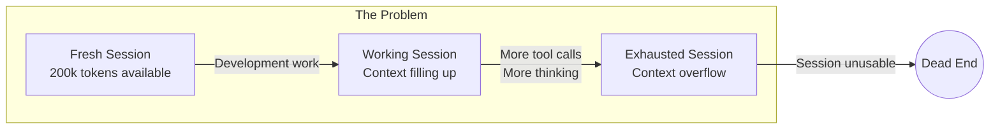
```mermaid
graph LR
    subgraph "The Problem"
        Start[Fresh Session<br/>200k tokens available]
        Middle[Working Session<br/>Context filling up]
        End[Exhausted Session<br/>Context overflow]
    end

    Start -->|Development work| Middle
    Middle -->|More tool calls<br/>More thinking| End
    End -->|"Session unusable"| X((Dead End))
```

### Pain Points

| Pain Point | Impact | Frequency |
|------------|--------|-----------|
| Context overflow mid-task | Lost productivity, must restart | High |
| No visibility into token usage | Can't anticipate overflow | Constant |
| Tool call bloat | Wastes context on completed operations | Every session |
| Thinking block accumulation | Extended thinking consumes significant space | Opus/Sonnet sessions |
| Session discovery difficulty | Hard to find and resume past work | Daily |

## 1.2 User Impact

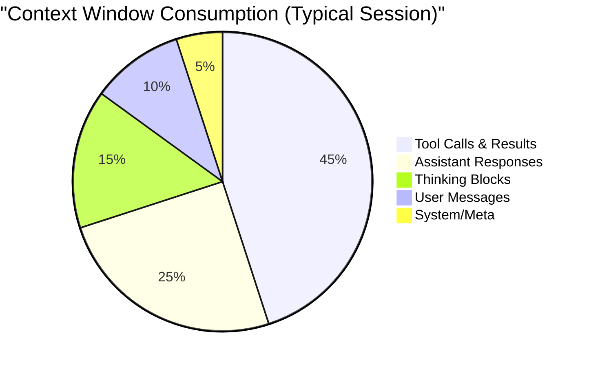
```mermaid
pie title "Context Window Consumption (Typical Session)"
    "Tool Calls & Results" : 45
    "Assistant Responses" : 25
    "Thinking Blocks" : 15
    "User Messages" : 10
    "System/Meta" : 5
```

**Key Insight**: Up to 60% of context can be consumed by tool operations and thinking blocks that are no longer relevant to the current task.

---

# 2. Solution Overview

## 2.1 Product Vision

> Enable developers to work indefinitely on complex Claude Code sessions by providing tools to understand, optimize, and manage context consumption.

## 2.2 Core Value Propositions

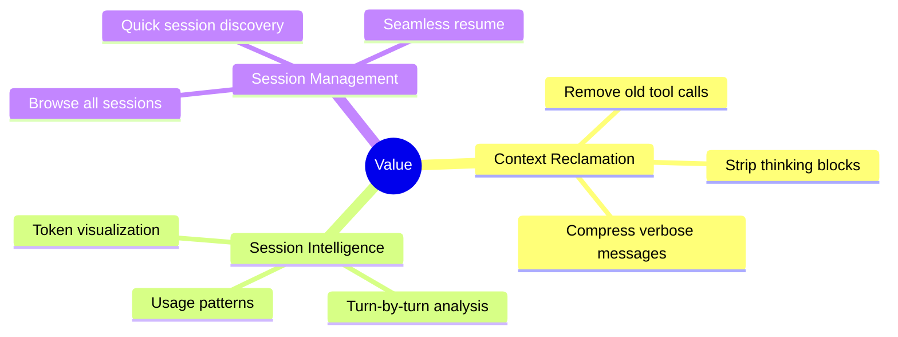
```mermaid
mindmap
  root((Value))
    Context Reclamation
      Remove old tool calls
      Strip thinking blocks
      Compress verbose messages
    Session Intelligence
      Token visualization
      Turn-by-turn analysis
      Usage patterns
    Session Management
      Browse all sessions
      Quick session discovery
      Seamless resume
```

## 2.3 Product Capabilities

| Capability | User Benefit | Business Value |
|------------|--------------|----------------|
| **Session Cloning** | Create optimized session copies | Enables continued work |
| **Tool Removal** | Strip tool calls from history | 30-50% context savings |
| **Thinking Removal** | Remove extended thinking | 10-20% context savings |
| **LLM Compression** | Intelligently compress messages | Additional 20-40% savings |
| **Token Visualization** | Understand consumption patterns | Informed optimization |
| **Session Browser** | Find and manage sessions | Improved workflow |

---

# 3. User Personas & Journeys

## 3.1 Primary Personas

### Persona 1: The Power Developer

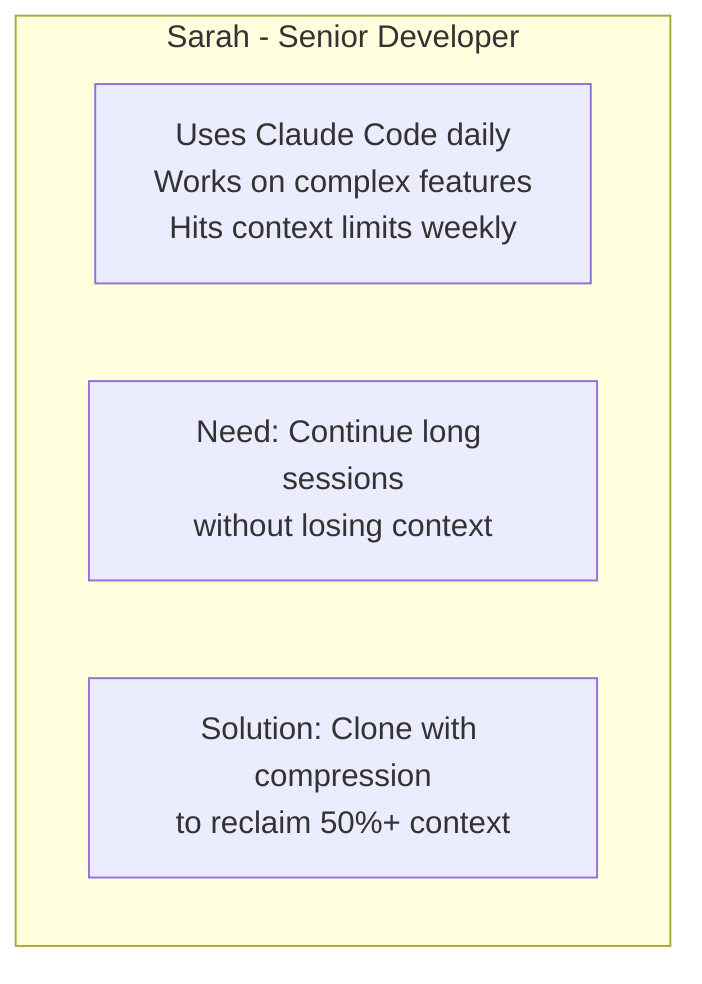
```mermaid
graph TB
    subgraph "Sarah - Senior Developer"
        Profile[Uses Claude Code daily<br/>Works on complex features<br/>Hits context limits weekly]
        Need[Need: Continue long sessions<br/>without losing context]
        Solution[Solution: Clone with compression<br/>to reclaim 50%+ context]
    end
```

**Characteristics:**
- Uses Claude Code 4+ hours daily
- Works on multi-file refactoring tasks
- Frequently encounters "context limit approaching" warnings
- Values efficiency and automation

**Key Jobs to Be Done:**
1. Continue working when context is nearly full
2. Understand what's consuming context
3. Make informed decisions about what to remove

### Persona 2: The Context-Conscious Developer

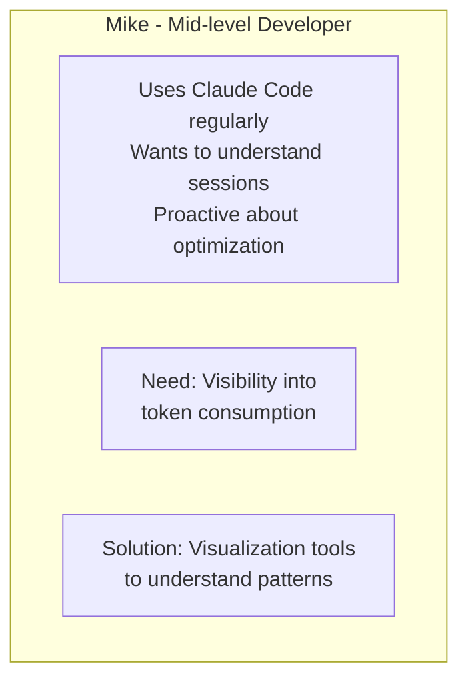
```mermaid
graph TB
    subgraph "Mike - Mid-level Developer"
        Profile[Uses Claude Code regularly<br/>Wants to understand sessions<br/>Proactive about optimization]
        Need[Need: Visibility into<br/>token consumption]
        Solution[Solution: Visualization tools<br/>to understand patterns]
    end
```

**Characteristics:**
- Uses Claude Code several times per week
- Curious about how context is consumed
- Wants to optimize before hitting limits
- Likes data-driven decisions

**Key Jobs to Be Done:**
1. See token breakdown by type
2. Identify optimization opportunities
3. Learn consumption patterns

### Persona 3: The Multi-Project Developer

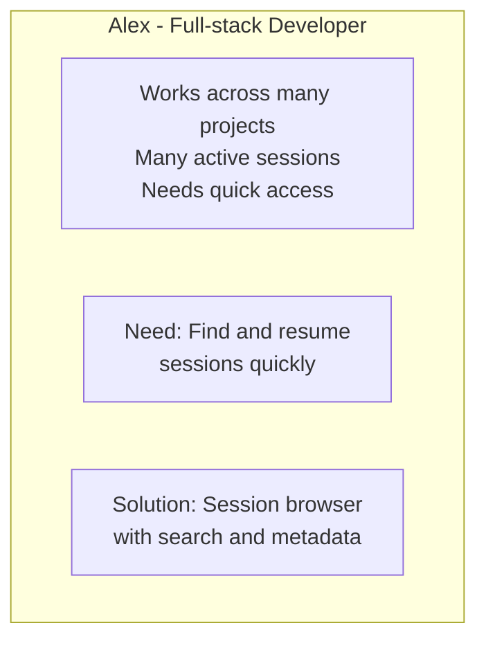
```mermaid
graph TB
    subgraph "Alex - Full-stack Developer"
        Profile[Works across many projects<br/>Many active sessions<br/>Needs quick access]
        Need[Need: Find and resume<br/>sessions quickly]
        Solution[Solution: Session browser<br/>with search and metadata]
    end
```

**Characteristics:**
- Works on 5+ projects simultaneously
- Has dozens of Claude Code sessions
- Frequently switches contexts
- Values organization and quick access

**Key Jobs to Be Done:**
1. Find sessions by project
2. See session metadata at a glance
3. Quickly resume past work

## 3.2 User Journey Maps

### Journey 1: Context Reclamation

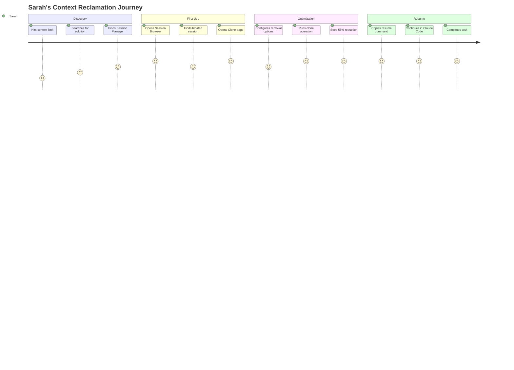
```mermaid
journey
    title Sarah's Context Reclamation Journey
    section Discovery
      Hits context limit: 2: Sarah
      Searches for solution: 3: Sarah
      Finds Session Manager: 4: Sarah
    section First Use
      Opens Session Browser: 5: Sarah
      Finds bloated session: 4: Sarah
      Opens Clone page: 5: Sarah
    section Optimization
      Configures removal options: 4: Sarah
      Runs clone operation: 5: Sarah
      Sees 55% reduction: 5: Sarah
    section Resume
      Copies resume command: 5: Sarah
      Continues in Claude Code: 5: Sarah
      Completes task: 5: Sarah
```

### Journey 2: Understanding Token Usage

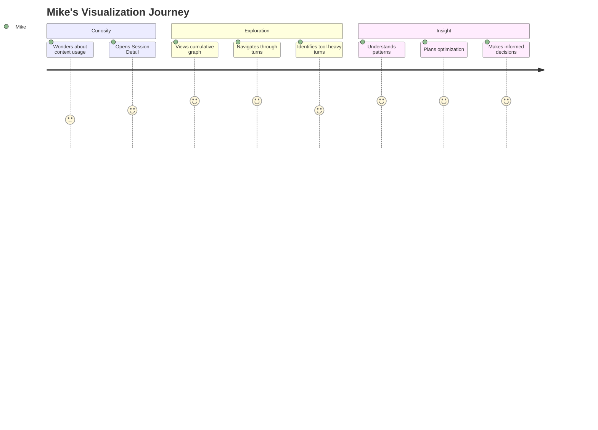
```mermaid
journey
    title Mike's Visualization Journey
    section Curiosity
      Wonders about context usage: 3: Mike
      Opens Session Detail: 4: Mike
    section Exploration
      Views cumulative graph: 5: Mike
      Navigates through turns: 5: Mike
      Identifies tool-heavy turns: 4: Mike
    section Insight
      Understands patterns: 5: Mike
      Plans optimization: 5: Mike
      Makes informed decisions: 5: Mike
```

### Journey 3: Session Discovery

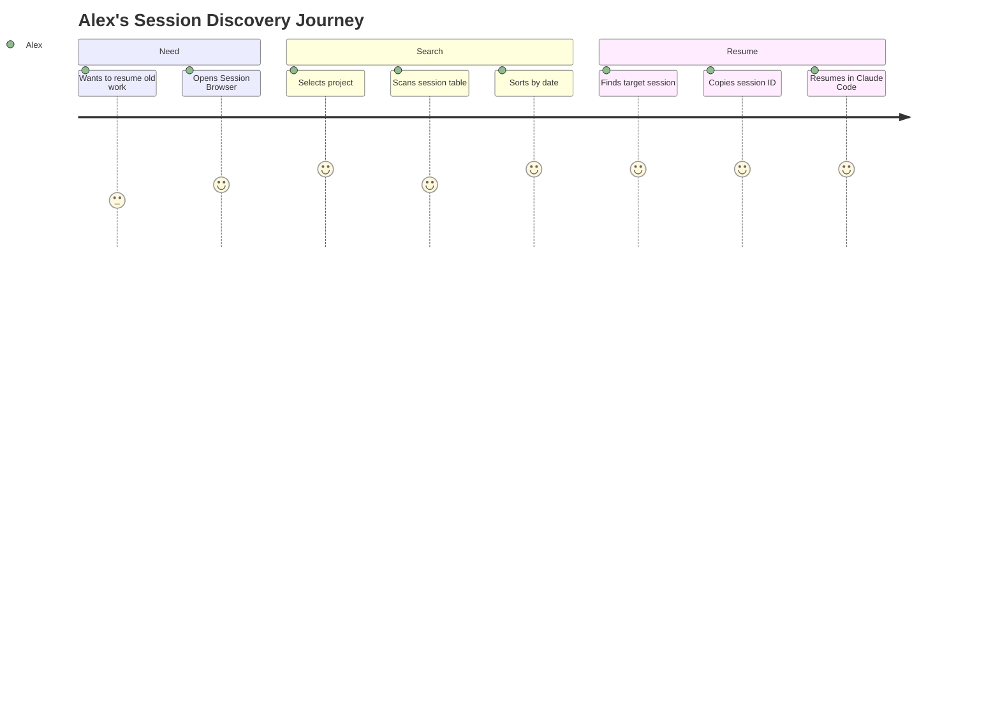
```mermaid
journey
    title Alex's Session Discovery Journey
    section Need
      Wants to resume old work: 3: Alex
      Opens Session Browser: 4: Alex
    section Search
      Selects project: 5: Alex
      Scans session table: 4: Alex
      Sorts by date: 5: Alex
    section Resume
      Finds target session: 5: Alex
      Copies session ID: 5: Alex
      Resumes in Claude Code: 5: Alex
```

---

# 4. Feature Breakdown

## 4.1 Session Browser

### 4.1.1 Feature Overview

The Session Browser is the application's home page, providing a centralized hub for discovering and accessing Claude Code sessions.

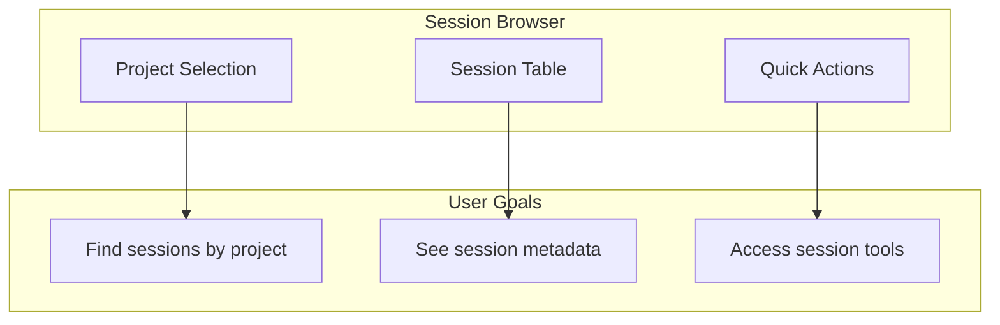
```mermaid
graph TB
    subgraph "Session Browser"
        Header[Project Selection]
        Content[Session Table]
        Actions[Quick Actions]
    end

    subgraph "User Goals"
        G1[Find sessions by project]
        G2[See session metadata]
        G3[Access session tools]
    end

    Header --> G1
    Content --> G2
    Actions --> G3
```

### 4.1.2 Functional Requirements

| ID | Requirement | Priority | Acceptance Criteria |
|----|-------------|----------|---------------------|
| SB-1 | Project dropdown | P0 | Lists all Claude Code projects |
| SB-2 | Session table | P0 | Shows all sessions in selected project |
| SB-3 | First message preview | P0 | Shows first 100 chars of first user message |
| SB-4 | Timestamp display | P0 | Shows created/modified as relative time |
| SB-5 | File size display | P0 | Shows human-readable file size |
| SB-6 | Turn count | P0 | Shows number of conversation turns |
| SB-7 | Column sorting | P1 | Click headers to sort asc/desc |
| SB-8 | Quick copy | P1 | Click session ID to copy full UUID |
| SB-9 | Clone action | P0 | Button navigates to Clone page |
| SB-10 | Visualize action | P0 | Button navigates to Session Detail |

### 4.1.3 User Interface

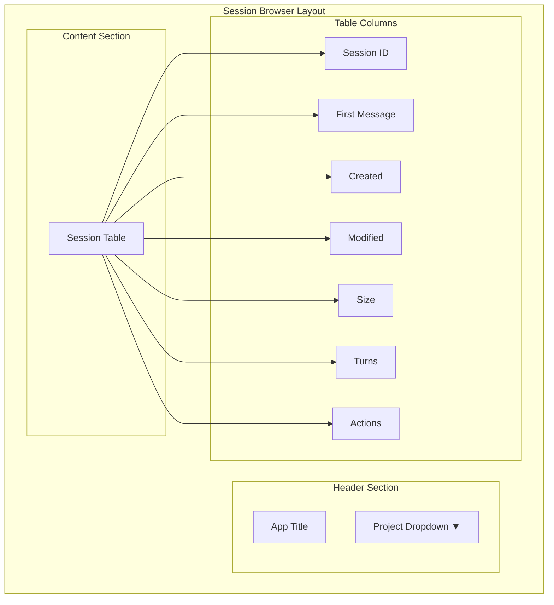
```mermaid
graph TB
    subgraph "Session Browser Layout"
        subgraph "Header Section"
            Logo[App Title]
            ProjectDropdown[Project Dropdown ▼]
        end

        subgraph "Content Section"
            Table[Session Table]
        end

        subgraph "Table Columns"
            C1[Session ID]
            C2[First Message]
            C3[Created]
            C4[Modified]
            C5[Size]
            C6[Turns]
            C7[Actions]
        end
    end

    Table --> C1
    Table --> C2
    Table --> C3
    Table --> C4
    Table --> C5
    Table --> C6
    Table --> C7
```

### 4.1.4 User Stories

```
As a developer,
I want to browse my Claude Code sessions by project,
So that I can quickly find and access past work.

As a developer,
I want to see session metadata at a glance,
So that I can identify the session I'm looking for.

As a developer,
I want to copy a session ID with one click,
So that I can easily reference it in Claude Code.

As a developer,
I want quick access to Clone and Visualize tools,
So that I can optimize or analyze sessions immediately.
```

### 4.1.5 Edge Cases & Error Handling

| Scenario | Behavior |
|----------|----------|
| No projects found | Show "No Claude Code projects found" message |
| Empty project | Show "No sessions in this project" message |
| Session file corrupted | Skip malformed entries, show partial data |
| Very long first message | Truncate to 100 chars with ellipsis |
| API request fails | Show error with retry button |

---

## 4.2 Session Cloning

### 4.2.1 Feature Overview

Session Cloning creates optimized copies of Claude Code sessions by selectively removing or compressing content to reclaim context window space.

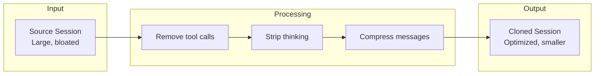
```mermaid
graph LR
    subgraph "Input"
        Source[Source Session<br/>Large, bloated]
    end

    subgraph "Processing"
        Remove[Remove tool calls]
        Strip[Strip thinking]
        Compress[Compress messages]
    end

    subgraph "Output"
        Clone[Cloned Session<br/>Optimized, smaller]
    end

    Source --> Remove --> Strip --> Compress --> Clone
```

### 4.2.2 Functional Requirements

| ID | Requirement | Priority | Acceptance Criteria |
|----|-------------|----------|---------------------|
| CL-1 | Session ID input | P0 | Accepts valid UUID |
| CL-2 | Tool removal options | P0 | None/50%/75%/100% removal |
| CL-3 | Thinking removal options | P0 | None/50%/75%/100% removal |
| CL-4 | Compression bands | P1 | Configure 0-2 compression bands |
| CL-5 | Band validation | P1 | Real-time validation feedback |
| CL-6 | Band preview | P1 | Visual preview of compression zones |
| CL-7 | Debug log option | P2 | Generate detailed compression log |
| CL-8 | Clone execution | P0 | Create new session file |
| CL-9 | Statistics display | P0 | Show before/after metrics |
| CL-10 | Resume command | P0 | Provide copy-able resume command |
| CL-11 | URL pre-fill | P1 | Accept sessionId query param |

### 4.2.3 Removal Logic

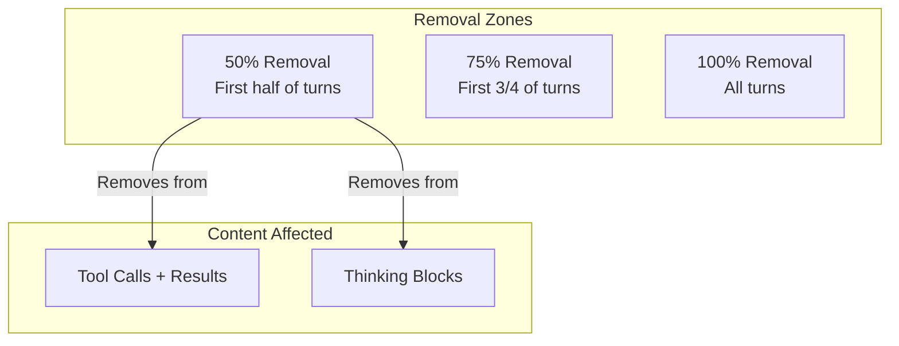
```mermaid
graph TB
    subgraph "Removal Zones"
        Zone50[50% Removal<br/>First half of turns]
        Zone75[75% Removal<br/>First 3/4 of turns]
        Zone100[100% Removal<br/>All turns]
    end

    subgraph "Content Affected"
        Tool[Tool Calls + Results]
        Thinking[Thinking Blocks]
    end

    Zone50 --> |Removes from| Tool
    Zone50 --> |Removes from| Thinking
```

**Removal Percentage Mapping:**

| Setting | Turns Affected | Example (20 turns) |
|---------|----------------|-------------------|
| None | 0% | No turns affected |
| 50% | First 50% | Turns 1-10 |
| 75% | First 75% | Turns 1-15 |
| 100% | All turns | Turns 1-20 |

### 4.2.4 Compression Bands

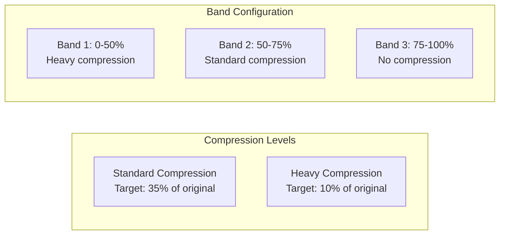
```mermaid
graph LR
    subgraph "Compression Levels"
        Standard[Standard Compression<br/>Target: 35% of original]
        Heavy[Heavy Compression<br/>Target: 10% of original]
    end

    subgraph "Band Configuration"
        Band1[Band 1: 0-50%<br/>Heavy compression]
        Band2[Band 2: 50-75%<br/>Standard compression]
        NoComp[Band 3: 75-100%<br/>No compression]
    end
```

**Compression Band Examples:**

| Band 1 | Band 2 | Effect |
|--------|--------|--------|
| `0-50 heavy` | `50-75 standard` | Aggressive early, moderate middle, preserve recent |
| `0-100 standard` | - | Moderate compression throughout |
| `0-25 heavy` | - | Only compress oldest quarter |

### 4.2.5 User Interface

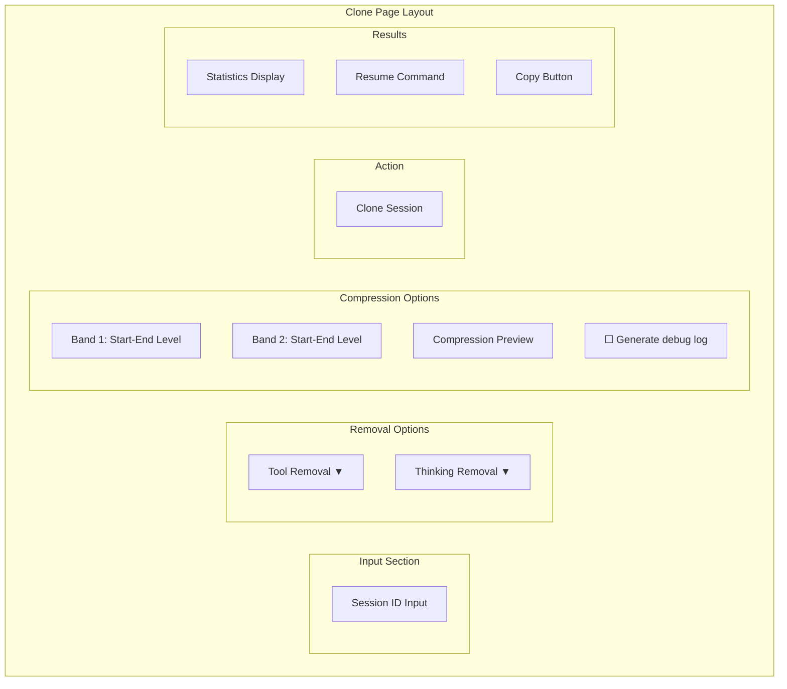
```mermaid
graph TB
    subgraph "Clone Page Layout"
        subgraph "Input Section"
            SessionInput[Session ID Input]
        end

        subgraph "Removal Options"
            ToolSelect[Tool Removal ▼]
            ThinkingSelect[Thinking Removal ▼]
        end

        subgraph "Compression Options"
            Band1Input[Band 1: Start-End Level]
            Band2Input[Band 2: Start-End Level]
            BandPreview[Compression Preview]
            DebugCheck[☐ Generate debug log]
        end

        subgraph "Action"
            SubmitBtn[Clone Session]
        end

        subgraph "Results"
            Stats[Statistics Display]
            Command[Resume Command]
            CopyBtn[Copy Button]
        end
    end
```

### 4.2.6 User Stories

```
As a developer with a bloated session,
I want to remove old tool calls,
So that I can reclaim context space for new work.

As a developer using extended thinking,
I want to remove old thinking blocks,
So that past reasoning doesn't consume current context.

As a developer who needs aggressive optimization,
I want to compress early conversation messages,
So that I can maximize available context.

As a developer,
I want to see statistics after cloning,
So that I know how much space was reclaimed.

As a developer,
I want a ready-to-use resume command,
So that I can immediately continue in Claude Code.
```

### 4.2.7 Output & Statistics

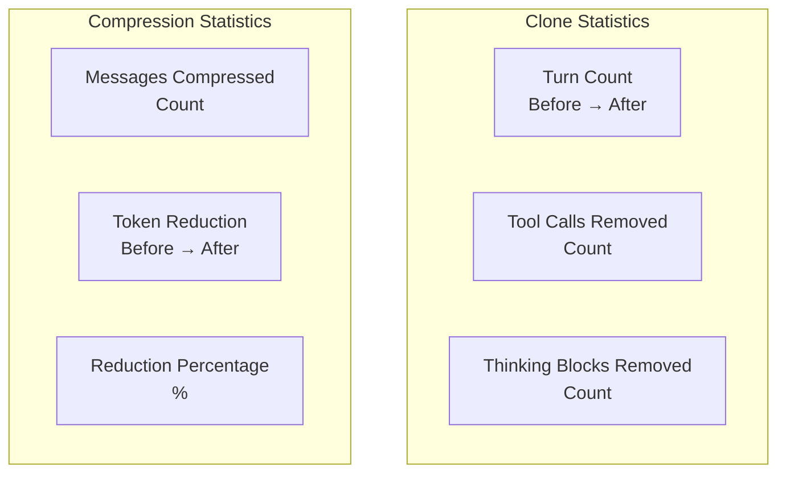
```mermaid
graph TB
    subgraph "Clone Statistics"
        Turns[Turn Count<br/>Before → After]
        Tools[Tool Calls Removed<br/>Count]
        Thinking[Thinking Blocks Removed<br/>Count]
    end

    subgraph "Compression Statistics"
        Messages[Messages Compressed<br/>Count]
        Tokens[Token Reduction<br/>Before → After]
        Percent[Reduction Percentage<br/>%]
    end
```

**Example Statistics Output:**

| Metric | Value |
|--------|-------|
| Original turns | 45 |
| Output turns | 45 |
| Tool calls removed | 127 |
| Thinking blocks removed | 32 |
| Messages compressed | 28 |
| Original tokens | 45,230 |
| Compressed tokens | 18,420 |
| Reduction | 59% |

---

## 4.3 Session Visualization

### 4.3.1 Feature Overview

Session Visualization provides insights into token consumption patterns through interactive charts and turn-by-turn analysis.

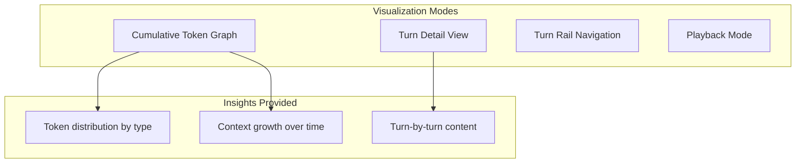
```mermaid
graph TB
    subgraph "Visualization Modes"
        Cumulative[Cumulative Token Graph]
        TurnDetail[Turn Detail View]
        TurnRail[Turn Rail Navigation]
        Playback[Playback Mode]
    end

    subgraph "Insights Provided"
        I1[Token distribution by type]
        I2[Turn-by-turn content]
        I3[Context growth over time]
    end

    Cumulative --> I1
    Cumulative --> I3
    TurnDetail --> I2
```

### 4.3.2 Functional Requirements

| ID | Requirement | Priority | Acceptance Criteria |
|----|-------------|----------|---------------------|
| VZ-1 | Session ID input | P0 | Accepts valid UUID or URL param |
| VZ-2 | Token visualization | P0 | Stacked area chart by type |
| VZ-3 | Turn navigation | P0 | Left/Right buttons, slider |
| VZ-4 | Turn input | P0 | Direct turn number entry |
| VZ-5 | Scale configuration | P1 | Adjust max token scale |
| VZ-6 | Scale auto-expand | P1 | Auto-increase if tokens exceed |
| VZ-7 | Turn detail card | P0 | Show turn content |
| VZ-8 | Turn rail | P1 | Scrollable turn history |
| VZ-9 | Playback mode | P2 | Animate through turns |
| VZ-10 | Playback speed | P2 | Configurable playback speed |
| VZ-11 | Clone link | P1 | Quick link to clone page |

### 4.3.3 Token Types & Colors

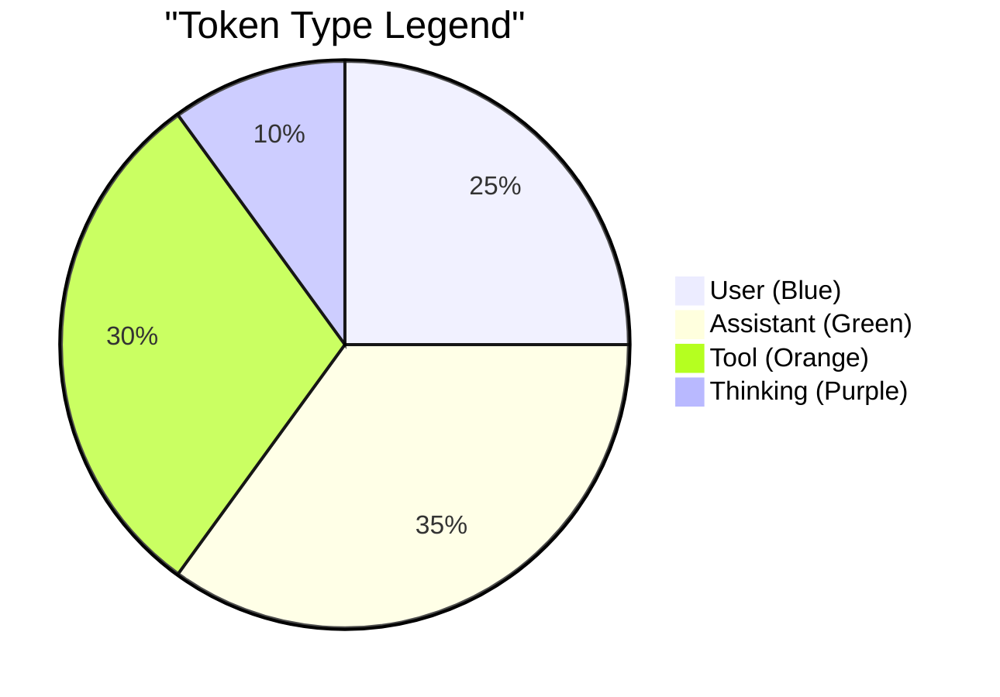
```mermaid
pie title "Token Type Legend"
    "User (Blue)" : 25
    "Assistant (Green)" : 35
    "Tool (Orange)" : 30
    "Thinking (Purple)" : 10
```

| Token Type | Color | Description |
|------------|-------|-------------|
| User | `#3b82f6` (Blue) | User message content |
| Assistant | `#22c55e` (Green) | Assistant response text |
| Tool | `#f97316` (Orange) | Tool calls and results |
| Thinking | `#a855f7` (Purple) | Extended thinking blocks |

### 4.3.4 User Interface

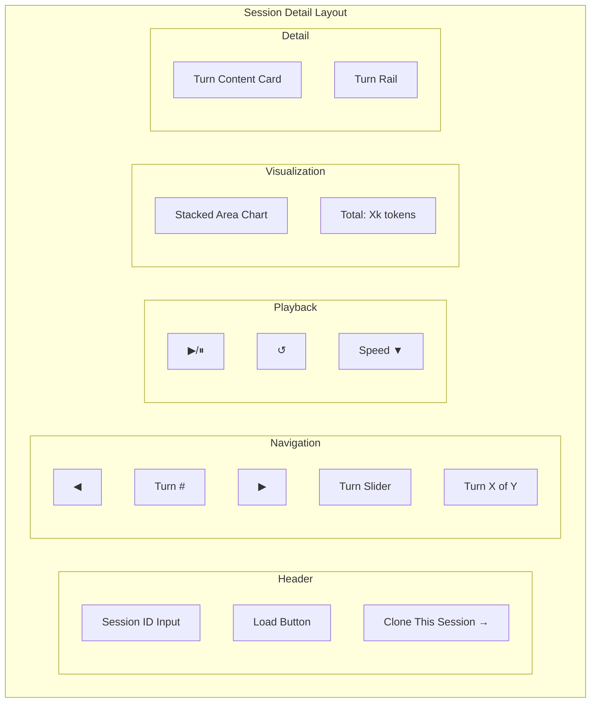
```mermaid
graph TB
    subgraph "Session Detail Layout"
        subgraph "Header"
            Input[Session ID Input]
            LoadBtn[Load Button]
            CloneLink[Clone This Session →]
        end

        subgraph "Navigation"
            LeftBtn[◀]
            TurnInput[Turn #]
            RightBtn[▶]
            Slider[Turn Slider]
            TurnLabel[Turn X of Y]
        end

        subgraph "Playback"
            PlayBtn[▶/⏸]
            ResetBtn[↺]
            SpeedSelect[Speed ▼]
        end

        subgraph "Visualization"
            Chart[Stacked Area Chart]
            Stats[Total: Xk tokens]
        end

        subgraph "Detail"
            DetailCard[Turn Content Card]
            TurnRail[Turn Rail]
        end
    end
```

### 4.3.5 Visualization Behavior

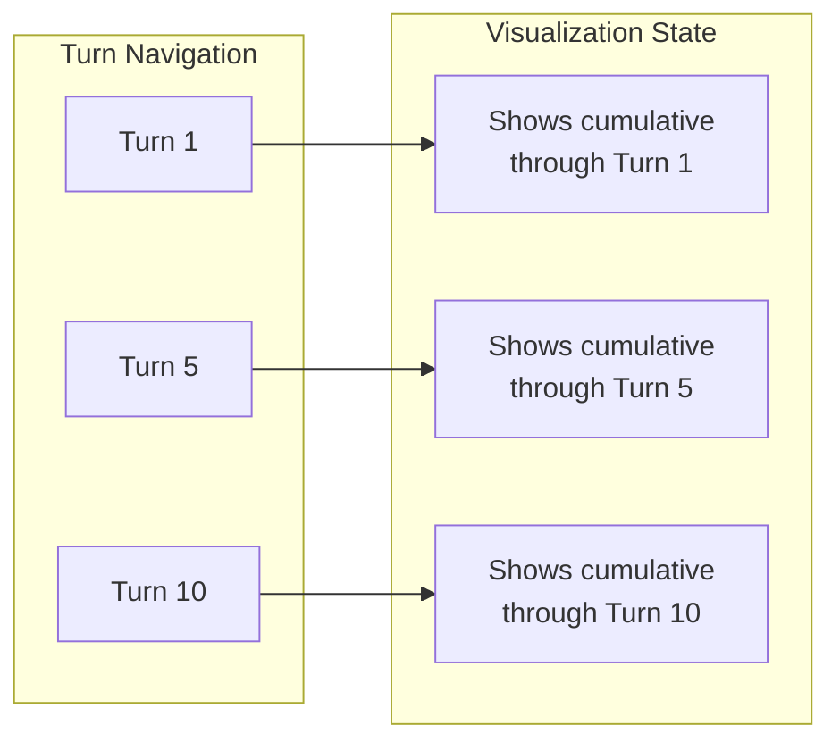
```mermaid
graph LR
    subgraph "Turn Navigation"
        Turn1[Turn 1]
        Turn5[Turn 5]
        Turn10[Turn 10]
    end

    subgraph "Visualization State"
        V1[Shows cumulative<br/>through Turn 1]
        V5[Shows cumulative<br/>through Turn 5]
        V10[Shows cumulative<br/>through Turn 10]
    end

    Turn1 --> V1
    Turn5 --> V5
    Turn10 --> V10
```

**Key Insight**: The visualization shows **cumulative** token consumption up to the selected turn, allowing users to see how context grows over the session.

### 4.3.6 User Stories

```
As a developer,
I want to see token consumption by type,
So that I can understand what's using my context.

As a developer,
I want to navigate through turns,
So that I can see how context grows over time.

As a developer,
I want to see turn content details,
So that I can identify what to optimize.

As a developer,
I want to play through the session,
So that I can watch context growth animate.

As a developer analyzing a session,
I want quick access to clone it,
So that I can optimize what I'm viewing.
```

### 4.3.7 Turn Detail Content

```mermaid
graph TB
    subgraph "Turn Detail Card"
        User[User Prompt<br/>Full text]
        Assistant[Assistant Response<br/>Full text]
        Tools[Tools Section<br/>Tool name + truncated content]
        Thinking[Thinking<br/>Truncated content]
    end
```

**Content Display Rules:**

| Content Type | Display |
|--------------|---------|
| User prompt | Full text |
| Assistant response | Full text |
| Tool calls | Tool name + first 6 lines |
| Tool results | Result ID + first 6 lines |
| Thinking | First 6 lines |

### 4.3.8 Turn Rail

The Turn Rail provides a scrollable, color-coded history of all turns up to the current position.

```mermaid
graph TB
    subgraph "Turn Rail (Newest at Top)"
        T5[Turn 5<br/>A:150t - Response text...<br/>T:45t - Read file...]
        T4[Turn 4<br/>U:25t - Can you help...]
        T3[Turn 3<br/>A:200t - Here's the fix...<br/>R:80t - Let me think...]
        T2[Turn 2<br/>T:120t - Bash command...]
        T1[Turn 1<br/>U:50t - Initial prompt...]
    end
```

**Rail Entry Format:**
- `A:Nt` - Assistant text (~N tokens)
- `U:Nt` - User text (~N tokens)
- `T:Nt` - Tool content (~N tokens)
- `R:Nt` - Thinking/Reasoning (~N tokens)

---

# 5. Information Architecture

## 5.1 Application Structure

```mermaid
graph TB
    subgraph "Session Manager"
        Home[Session Browser<br/>/]
        Clone[Clone Page<br/>/session-clone]
        Detail[Session Detail<br/>/session-detail]
        Visualize[Stack Viz<br/>/visualize]
    end

    subgraph "Navigation"
        Home -->|Clone action| Clone
        Home -->|Visualize action| Detail
        Detail -->|Clone link| Clone
        Clone -->|Back| Home
        Detail -->|Back| Home
    end
```

## 5.2 Page Inventory

| Page | URL | Purpose | Entry Points |
|------|-----|---------|--------------|
| Session Browser | `/` | Browse & discover sessions | Direct navigation |
| Clone | `/session-clone` | Optimize sessions | Browser action, Detail link |
| Session Detail | `/session-detail` | Turn-by-turn analysis | Browser action |
| Visualize | `/visualize` | Stack visualization | Direct navigation |

## 5.3 Data Flow

```mermaid
graph LR
    subgraph "Source"
        Sessions[~/.claude/projects/<br/>*.jsonl files]
    end

    subgraph "Application"
        Browser[Session Browser]
        Clone[Clone Page]
        Detail[Session Detail]
    end

    subgraph "Output"
        NewSession[New .jsonl file]
        Lineage[Lineage log]
    end

    Sessions --> Browser
    Sessions --> Clone
    Sessions --> Detail
    Clone --> NewSession
    Clone --> Lineage
```

---

# 6. Non-Functional Requirements

## 6.1 Performance

| Metric | Target | Rationale |
|--------|--------|-----------|
| Page load | < 2s | Responsive UX |
| Project list | < 500ms | Quick navigation |
| Session list | < 1s for 50 sessions | Reasonable project size |
| Clone operation | < 30s without compression | Acceptable wait |
| Clone with compression | < 5min | LLM calls are slow |
| Visualization render | < 500ms | Smooth interaction |

## 6.2 Scalability

| Dimension | Support Level |
|-----------|---------------|
| Sessions per project | 100+ |
| Projects | 50+ |
| Session size | Up to 50MB |
| Turns per session | 1000+ |

## 6.3 Reliability

| Scenario | Handling |
|----------|----------|
| Session file missing | Clear error message |
| Malformed JSONL | Skip bad lines, process rest |
| LLM provider timeout | Retry with backoff |
| Compression failure | Preserve original content |
| Clone failure | No partial writes |

## 6.4 Security

| Concern | Mitigation |
|---------|------------|
| Path traversal | Validate folder names |
| API key exposure | Server-side only |
| Session data privacy | Local processing only |
| XSS | HTML escaping |

---

# 7. Success Metrics

## 7.1 Key Performance Indicators

```mermaid
graph TB
    subgraph "Usage Metrics"
        M1[Sessions cloned per week]
        M2[Context reclaimed per clone]
        M3[Sessions browsed per day]
    end

    subgraph "Quality Metrics"
        Q1[Clone success rate]
        Q2[Compression effectiveness]
        Q3[Error rate]
    end

    subgraph "Engagement Metrics"
        E1[Return users]
        E2[Features used per session]
        E3[Time to first clone]
    end
```

## 7.2 Target Metrics

| Metric | Target | Measurement |
|--------|--------|-------------|
| Context reclaimed | > 40% average | (original - clone) / original |
| Clone success rate | > 99% | Successful / attempted |
| Compression success | > 95% | Messages compressed / attempted |
| Session discovery time | < 30s | Time from open to found session |
| Error rate | < 1% | Errors / operations |

---

# 8. Roadmap & Future Considerations

## 8.1 Current State (v1.0)

```mermaid
timeline
    title Product Evolution
    section Foundation
        Session Cloning : Basic cloning
                        : Tool removal
                        : Thinking removal
    section Enhancement
        LLM Compression : Compression bands
                       : Provider abstraction
    section Intelligence
        Visualization : Token distribution
                     : Turn navigation
                     : Playback mode
    section Discovery
        Session Browser : Project listing
                       : Session table
                       : Quick actions
```

## 8.2 Potential Future Features

| Feature | Description | User Value |
|---------|-------------|------------|
| **Turn Operations** | Delete/compress individual turns | Fine-grained control |
| **Batch Operations** | Clone multiple sessions | Efficiency |
| **Auto-optimization** | AI-suggested optimization | Intelligent assistance |
| **Session Search** | Full-text search across sessions | Better discovery |
| **GitHub Copilot Support** | Multi-source sessions | Broader applicability |
| **Session Comparison** | Compare before/after | Verification |
| **Export/Import** | Session backup/restore | Data portability |

## 8.3 Integration Opportunities

```mermaid
graph TB
    subgraph "Current"
        App[Session Manager]
        Claude[Claude Code CLI]
    end

    subgraph "Potential Integrations"
        VSCode[VS Code Extension]
        Copilot[GitHub Copilot]
        API[Public API]
        CI[CI/CD Integration]
    end

    App --> Claude
    App -.-> VSCode
    App -.-> Copilot
    App -.-> API
    App -.-> CI
```

---

# 9. Appendices

## A. Glossary

| Term | Definition |
|------|------------|
| **Context Window** | Maximum token capacity for a Claude conversation |
| **Turn** | A user message and all subsequent assistant responses until next user message |
| **Tool Call** | Assistant invocation of a tool (file read, bash, etc.) |
| **Tool Result** | Response content from a tool call |
| **Thinking Block** | Extended thinking content (Opus/Sonnet with thinking enabled) |
| **Compression Band** | A percentage range of turns to apply compression to |
| **Session** | A Claude Code conversation stored as a JSONL file |
| **JSONL** | JSON Lines format - one JSON object per line |

## B. Session File Structure

```
Session Location: ~/.claude/projects/<encoded-path>/<uuid>.jsonl

Entry Types:
- user: User messages (start of turns)
- assistant: Claude responses
- summary: Session metadata
- file-history-snapshot: File state
- queue-operation: Internal operations
- system: System messages (meta)
```

## C. Token Estimation

The application uses a simple heuristic for token estimation:

```
Tokens ≈ Character Count / 4
```

This provides a reasonable approximation for planning purposes without requiring API calls.

---

*Product Brief for Claude Code Session Manager v1.0*
*Last Updated: December 2024*
