# Claude Code Session Manager - Technical Design Document

## Document Overview

This document provides a comprehensive technical design of the Claude Code Session Manager, progressing from high-level functional overview to detailed component-level specifications with UML diagrams.

---

# 1. Functional Overview

## 1.1 Purpose

The Claude Code Session Manager is a standalone web application that provides tools for managing, analyzing, and optimizing Claude Code sessions. It addresses a critical developer need: **context window management** for long-running Claude Code sessions.

## 1.2 Core Capabilities

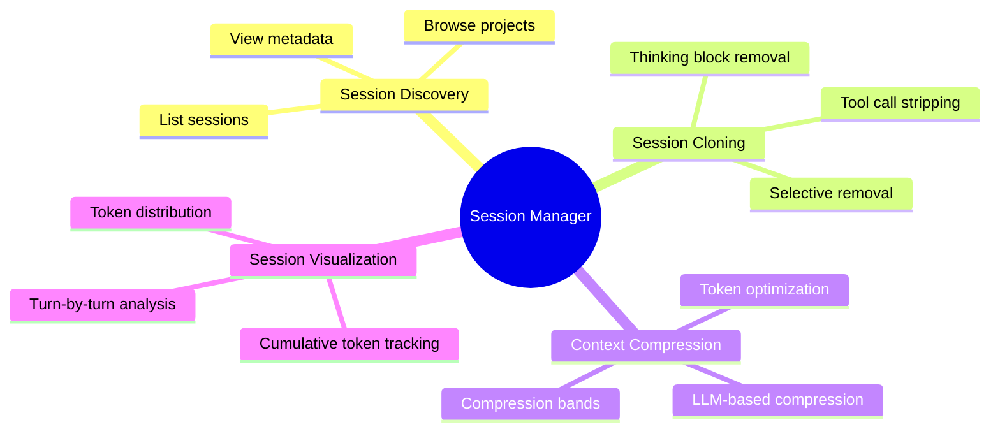
```mermaid
mindmap
  root((Session Manager))
    Session Discovery
      Browse projects
      List sessions
      View metadata
    Session Cloning
      Selective removal
      Tool call stripping
      Thinking block removal
    Context Compression
      LLM-based compression
      Compression bands
      Token optimization
    Session Visualization
      Token distribution
      Turn-by-turn analysis
      Cumulative token tracking
```

## 1.3 User Personas

| Persona | Need | Primary Feature |
|---------|------|-----------------|
| Developer with context overflow | Reclaim context window space | Session Cloning + Compression |
| Developer debugging session | Understand token consumption | Session Visualization |
| Developer starting new work | Find and resume past sessions | Session Browser |

## 1.4 High-Level Use Cases

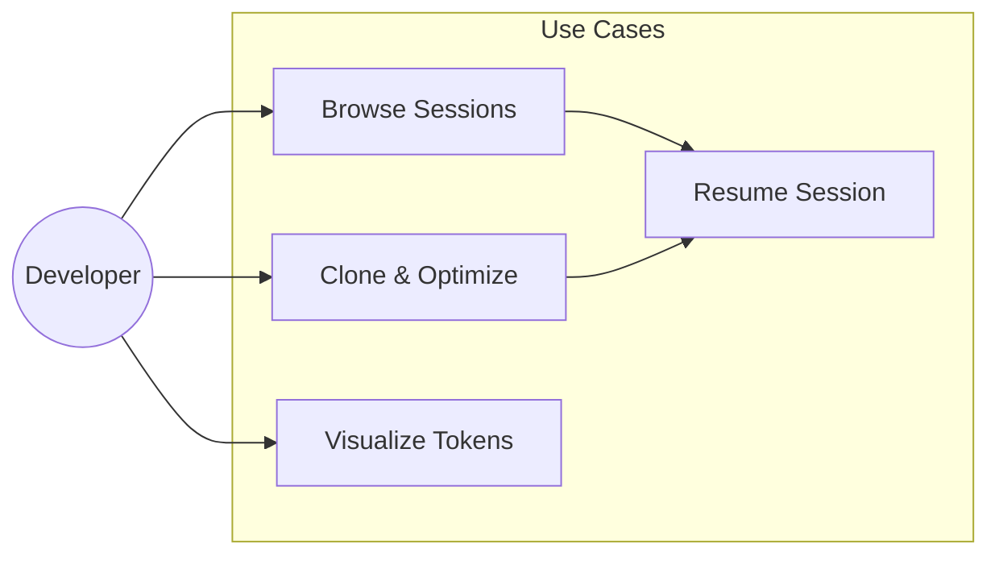
```mermaid
graph LR
    subgraph "Use Cases"
        UC1[Browse Sessions]
        UC2[Clone & Optimize]
        UC3[Visualize Tokens]
        UC4[Resume Session]
    end

    User((Developer)) --> UC1
    User --> UC2
    User --> UC3

    UC1 --> UC4
    UC2 --> UC4
```

---

# 2. Technology Stack & Architecture Overview

## 2.1 Technology Stack

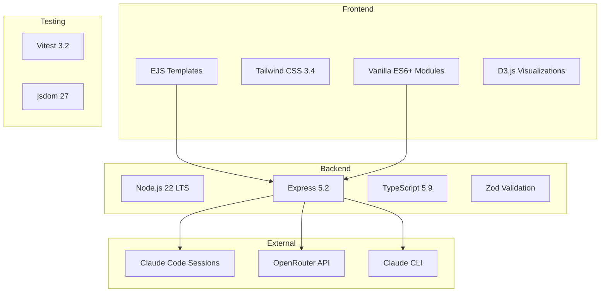
```mermaid
graph TB
    subgraph "Frontend"
        HTML[EJS Templates]
        CSS[Tailwind CSS 3.4]
        JS[Vanilla ES6+ Modules]
        D3[D3.js Visualizations]
    end

    subgraph "Backend"
        Node[Node.js 22 LTS]
        Express[Express 5.2]
        TS[TypeScript 5.9]
        Zod[Zod Validation]
    end

    subgraph "External"
        Claude[Claude Code Sessions]
        OpenRouter[OpenRouter API]
        ClaudeCLI[Claude CLI]
    end

    subgraph "Testing"
        Vitest[Vitest 3.2]
        jsdom[jsdom 27]
    end

    HTML --> Express
    JS --> Express
    Express --> Claude
    Express --> OpenRouter
    Express --> ClaudeCLI
```

## 2.2 High-Level Architecture

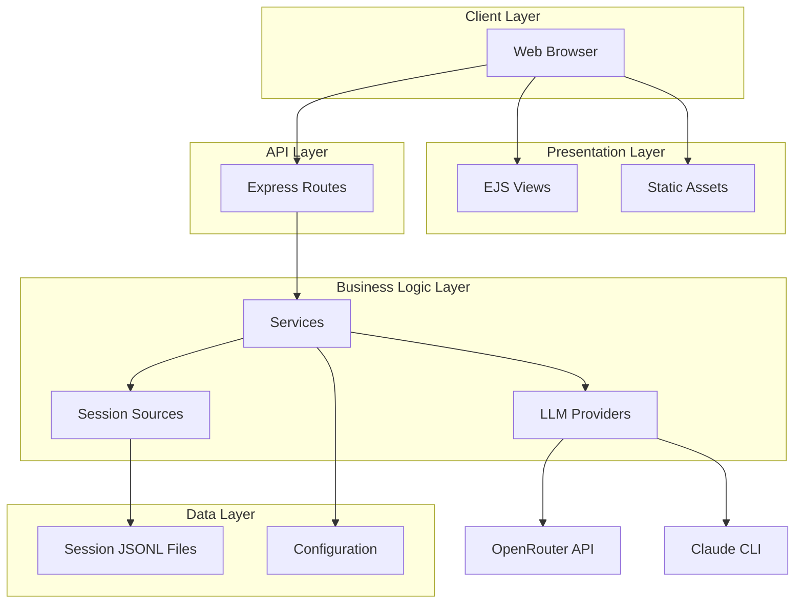
```mermaid
graph TB
    subgraph "Client Layer"
        Browser[Web Browser]
    end

    subgraph "Presentation Layer"
        Views[EJS Views]
        Static[Static Assets]
    end

    subgraph "API Layer"
        Routes[Express Routes]
    end

    subgraph "Business Logic Layer"
        Services[Services]
        Providers[LLM Providers]
        Sources[Session Sources]
    end

    subgraph "Data Layer"
        JSONL[Session JSONL Files]
        Config[Configuration]
    end

    Browser --> Views
    Browser --> Static
    Browser --> Routes
    Routes --> Services
    Services --> Providers
    Services --> Sources
    Sources --> JSONL
    Providers --> OpenRouter[OpenRouter API]
    Providers --> ClaudeCLI[Claude CLI]
    Services --> Config
```

## 2.3 Directory Structure

```
coding-agent-manager/
├── src/                          # Server-side TypeScript
│   ├── server.ts                 # Express app entry point
│   ├── config.ts                 # Configuration management
│   ├── types.ts                  # Shared type definitions
│   ├── errors.ts                 # Custom error classes
│   ├── routes/                   # HTTP route handlers
│   │   ├── clone.ts              # V1 clone API
│   │   ├── clone-v2.ts           # V2 clone API (with compression)
│   │   ├── session-browser.ts    # Browser routes
│   │   ├── session-structure.ts  # Visualization API
│   │   └── session-turns.ts      # Turn detail API
│   ├── services/                 # Business logic
│   │   ├── session-clone.ts      # Core cloning logic
│   │   ├── compression.ts        # Compression orchestration
│   │   ├── compression-batch.ts  # Batch processing
│   │   ├── session-structure.ts  # Structure analysis
│   │   ├── session-turns.ts      # Turn extraction
│   │   └── lineage-logger.ts     # Clone tracking
│   ├── providers/                # LLM provider abstraction
│   │   ├── index.ts              # Provider factory
│   │   ├── types.ts              # Provider interface
│   │   ├── openrouter-provider.ts
│   │   └── claude-cli-provider.ts
│   └── sources/                  # Session source abstraction
│       ├── index.ts              # Source factory
│       ├── types.ts              # Source interface
│       └── claude-source.ts      # Claude Code source
├── public/                       # Client-side assets
│   ├── js/
│   │   ├── api/                  # HTTP clients
│   │   ├── lib/                  # Pure utility functions
│   │   ├── ui/                   # DOM components
│   │   └── pages/                # Page controllers
│   └── css/                      # Styles
├── views/                        # EJS templates
│   └── pages/                    # Page templates
└── test/                         # Test suites
    ├── fixtures/                 # Test data
    └── *.test.ts                 # Test files
```

## 2.4 Component Relationship Diagram

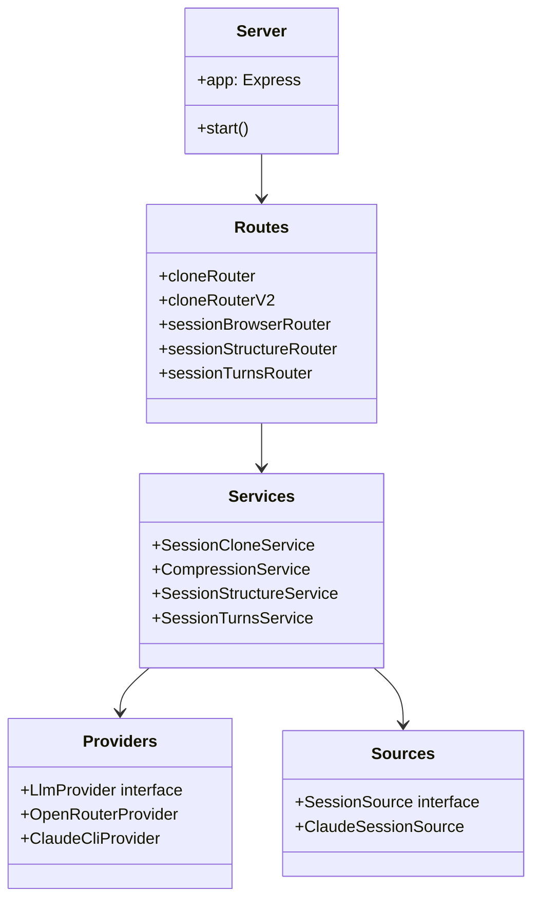
```mermaid
classDiagram
    class Server {
        +app: Express
        +start()
    }

    class Routes {
        +cloneRouter
        +cloneRouterV2
        +sessionBrowserRouter
        +sessionStructureRouter
        +sessionTurnsRouter
    }

    class Services {
        +SessionCloneService
        +CompressionService
        +SessionStructureService
        +SessionTurnsService
    }

    class Providers {
        +LlmProvider interface
        +OpenRouterProvider
        +ClaudeCliProvider
    }

    class Sources {
        +SessionSource interface
        +ClaudeSessionSource
    }

    Server --> Routes
    Routes --> Services
    Services --> Providers
    Services --> Sources
```

---

# 3. Session Listing (Session Browser)

## 3.1 Overview

The Session Browser provides discovery and navigation of Claude Code sessions, serving as the application's home page.

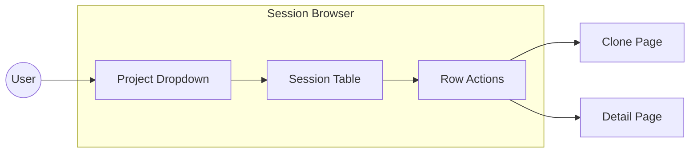
```mermaid
graph LR
    subgraph "Session Browser"
        ProjectList[Project Dropdown]
        SessionTable[Session Table]
        Actions[Row Actions]
    end

    User((User)) --> ProjectList
    ProjectList --> SessionTable
    SessionTable --> Actions
    Actions --> Clone[Clone Page]
    Actions --> Detail[Detail Page]
```

## 3.2 API Endpoints

| Method | Endpoint | Description |
|--------|----------|-------------|
| GET | `/` | Session Browser page |
| GET | `/api/projects` | List all projects |
| GET | `/api/projects/:folder/sessions` | List sessions in project |

## 3.3 Component Architecture

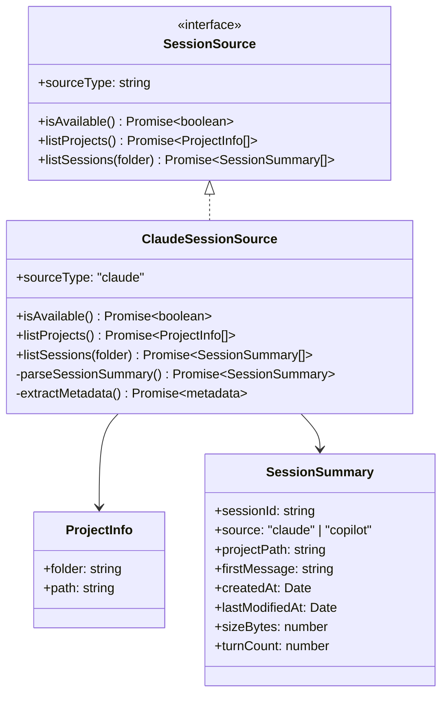
```mermaid
classDiagram
    class SessionSource {
        <<interface>>
        +sourceType: string
        +isAvailable() Promise~boolean~
        +listProjects() Promise~ProjectInfo[]~
        +listSessions(folder) Promise~SessionSummary[]~
    }

    class ClaudeSessionSource {
        +sourceType: "claude"
        +isAvailable() Promise~boolean~
        +listProjects() Promise~ProjectInfo[]~
        +listSessions(folder) Promise~SessionSummary[]~
        -parseSessionSummary() Promise~SessionSummary~
        -extractMetadata() Promise~metadata~
    }

    class ProjectInfo {
        +folder: string
        +path: string
    }

    class SessionSummary {
        +sessionId: string
        +source: "claude" | "copilot"
        +projectPath: string
        +firstMessage: string
        +createdAt: Date
        +lastModifiedAt: Date
        +sizeBytes: number
        +turnCount: number
    }

    SessionSource <|.. ClaudeSessionSource
    ClaudeSessionSource --> ProjectInfo
    ClaudeSessionSource --> SessionSummary
```

## 3.4 Data Flow

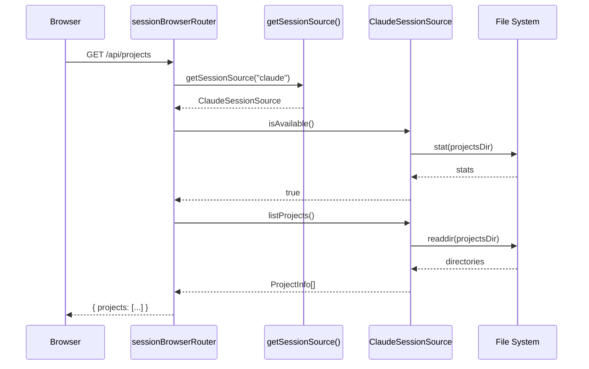
```mermaid
sequenceDiagram
    participant Browser
    participant Router as sessionBrowserRouter
    participant Factory as getSessionSource()
    participant Source as ClaudeSessionSource
    participant FS as File System

    Browser->>Router: GET /api/projects
    Router->>Factory: getSessionSource("claude")
    Factory-->>Router: ClaudeSessionSource
    Router->>Source: isAvailable()
    Source->>FS: stat(projectsDir)
    FS-->>Source: stats
    Source-->>Router: true
    Router->>Source: listProjects()
    Source->>FS: readdir(projectsDir)
    FS-->>Source: directories
    Source-->>Router: ProjectInfo[]
    Router-->>Browser: { projects: [...] }
```

## 3.5 Session Listing Sequence

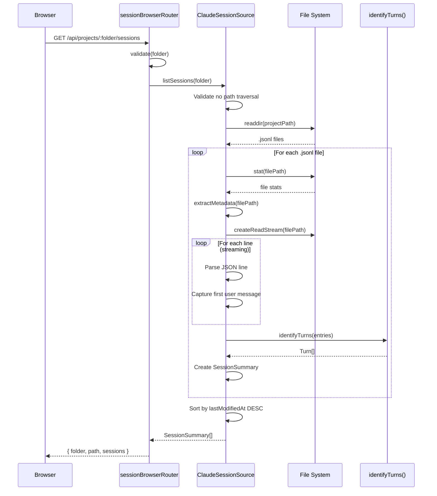
```mermaid
sequenceDiagram
    participant Browser
    participant Router as sessionBrowserRouter
    participant Source as ClaudeSessionSource
    participant FS as File System
    participant Parser as identifyTurns()

    Browser->>Router: GET /api/projects/:folder/sessions
    Router->>Router: validate(folder)
    Router->>Source: listSessions(folder)
    Source->>Source: Validate no path traversal
    Source->>FS: readdir(projectPath)
    FS-->>Source: .jsonl files

    loop For each .jsonl file
        Source->>FS: stat(filePath)
        FS-->>Source: file stats
        Source->>Source: extractMetadata(filePath)
        Source->>FS: createReadStream(filePath)

        loop For each line (streaming)
            Source->>Source: Parse JSON line
            Source->>Source: Capture first user message
        end

        Source->>Parser: identifyTurns(entries)
        Parser-->>Source: Turn[]
        Source->>Source: Create SessionSummary
    end

    Source->>Source: Sort by lastModifiedAt DESC
    Source-->>Router: SessionSummary[]
    Router-->>Browser: { folder, path, sessions }
```

## 3.6 Frontend Architecture

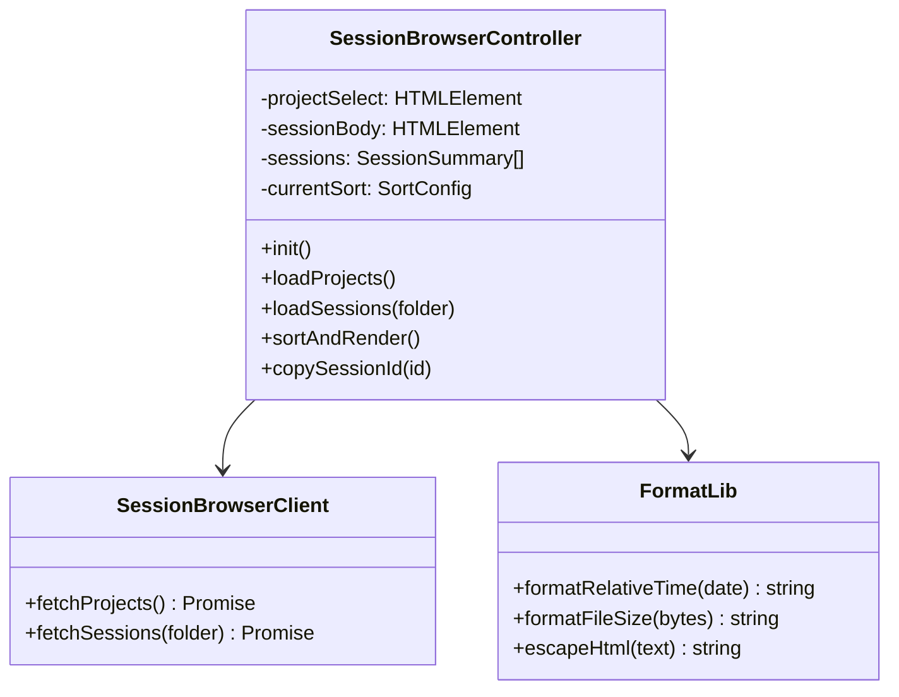
```mermaid
classDiagram
    class SessionBrowserController {
        -projectSelect: HTMLElement
        -sessionBody: HTMLElement
        -sessions: SessionSummary[]
        -currentSort: SortConfig
        +init()
        +loadProjects()
        +loadSessions(folder)
        +sortAndRender()
        +copySessionId(id)
    }

    class SessionBrowserClient {
        +fetchProjects() Promise
        +fetchSessions(folder) Promise
    }

    class FormatLib {
        +formatRelativeTime(date) string
        +formatFileSize(bytes) string
        +escapeHtml(text) string
    }

    SessionBrowserController --> SessionBrowserClient
    SessionBrowserController --> FormatLib
```

## 3.7 State Management

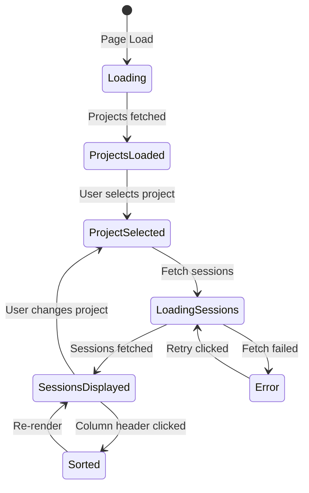
```mermaid
stateDiagram-v2
    [*] --> Loading: Page Load
    Loading --> ProjectsLoaded: Projects fetched
    ProjectsLoaded --> ProjectSelected: User selects project
    ProjectSelected --> LoadingSessions: Fetch sessions
    LoadingSessions --> SessionsDisplayed: Sessions fetched
    LoadingSessions --> Error: Fetch failed
    Error --> LoadingSessions: Retry clicked
    SessionsDisplayed --> ProjectSelected: User changes project
    SessionsDisplayed --> Sorted: Column header clicked
    Sorted --> SessionsDisplayed: Re-render
```

---

# 4. Session Cloning & Compression

## 4.1 Overview

Session cloning creates optimized copies of Claude Code sessions by selectively removing or compressing content to reclaim context window space.

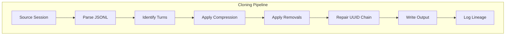
```mermaid
graph TB
    subgraph "Cloning Pipeline"
        Input[Source Session]
        Parse[Parse JSONL]
        Identify[Identify Turns]
        Compress[Apply Compression]
        Remove[Apply Removals]
        Repair[Repair UUID Chain]
        Write[Write Output]
        Log[Log Lineage]
    end

    Input --> Parse --> Identify --> Compress --> Remove --> Repair --> Write --> Log
```

## 4.2 API Endpoints

| Method | Endpoint | Description |
|--------|----------|-------------|
| POST | `/api/clone` | V1 Clone (removal only) |
| POST | `/api/v2/clone` | V2 Clone (compression + removal) |

## 4.3 Request/Response Schemas

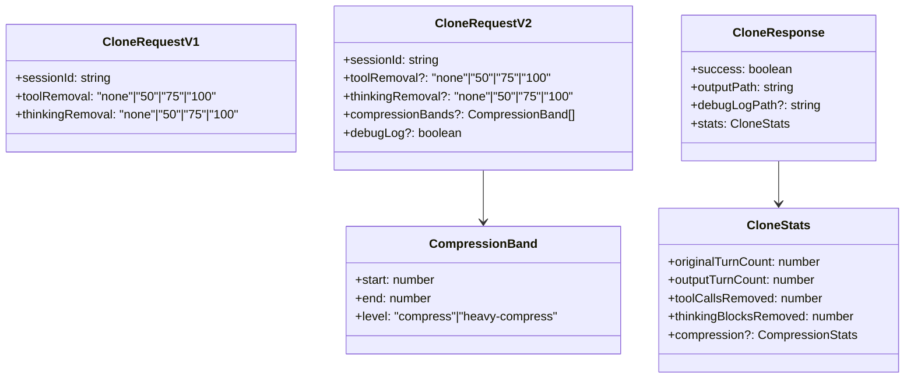
```mermaid
classDiagram
    class CloneRequestV1 {
        +sessionId: string
        +toolRemoval: "none"|"50"|"75"|"100"
        +thinkingRemoval: "none"|"50"|"75"|"100"
    }

    class CloneRequestV2 {
        +sessionId: string
        +toolRemoval?: "none"|"50"|"75"|"100"
        +thinkingRemoval?: "none"|"50"|"75"|"100"
        +compressionBands?: CompressionBand[]
        +debugLog?: boolean
    }

    class CompressionBand {
        +start: number
        +end: number
        +level: "compress"|"heavy-compress"
    }

    class CloneResponse {
        +success: boolean
        +outputPath: string
        +debugLogPath?: string
        +stats: CloneStats
    }

    class CloneStats {
        +originalTurnCount: number
        +outputTurnCount: number
        +toolCallsRemoved: number
        +thinkingBlocksRemoved: number
        +compression?: CompressionStats
    }

    CloneRequestV2 --> CompressionBand
    CloneResponse --> CloneStats
```

## 4.4 Core Service Architecture

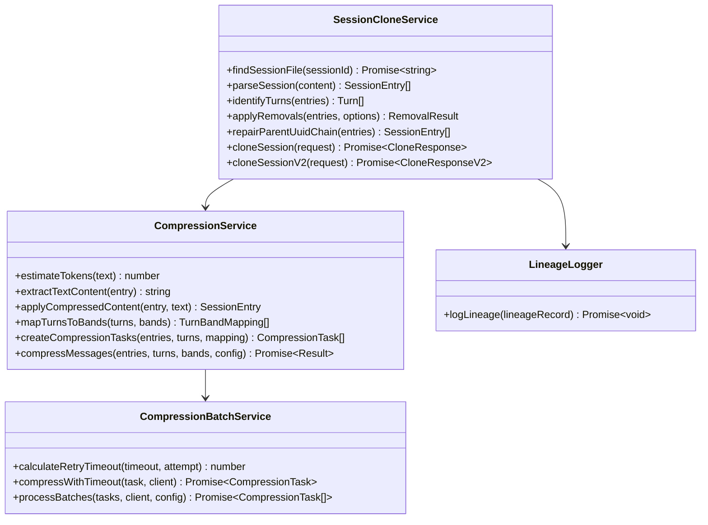
```mermaid
classDiagram
    class SessionCloneService {
        +findSessionFile(sessionId) Promise~string~
        +parseSession(content) SessionEntry[]
        +identifyTurns(entries) Turn[]
        +applyRemovals(entries, options) RemovalResult
        +repairParentUuidChain(entries) SessionEntry[]
        +cloneSession(request) Promise~CloneResponse~
        +cloneSessionV2(request) Promise~CloneResponseV2~
    }

    class CompressionService {
        +estimateTokens(text) number
        +extractTextContent(entry) string
        +applyCompressedContent(entry, text) SessionEntry
        +mapTurnsToBands(turns, bands) TurnBandMapping[]
        +createCompressionTasks(entries, turns, mapping) CompressionTask[]
        +compressMessages(entries, turns, bands, config) Promise~Result~
    }

    class CompressionBatchService {
        +calculateRetryTimeout(timeout, attempt) number
        +compressWithTimeout(task, client) Promise~CompressionTask~
        +processBatches(tasks, client, config) Promise~CompressionTask[]~
    }

    class LineageLogger {
        +logLineage(lineageRecord) Promise~void~
    }

    SessionCloneService --> CompressionService
    CompressionService --> CompressionBatchService
    SessionCloneService --> LineageLogger
```

## 4.5 V2 Clone Sequence Diagram

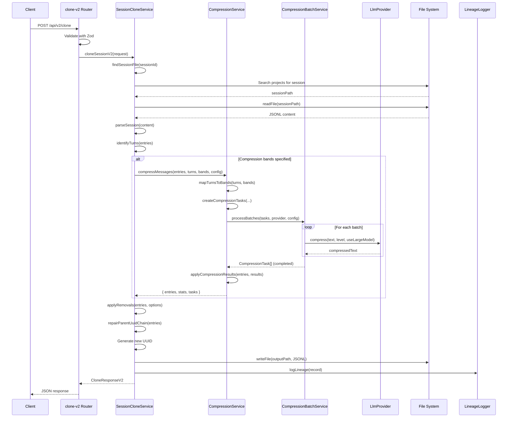
```mermaid
sequenceDiagram
    participant Client
    participant Router as clone-v2 Router
    participant Clone as SessionCloneService
    participant Compress as CompressionService
    participant Batch as CompressionBatchService
    participant Provider as LlmProvider
    participant FS as File System
    participant Logger as LineageLogger

    Client->>Router: POST /api/v2/clone
    Router->>Router: Validate with Zod
    Router->>Clone: cloneSessionV2(request)

    Clone->>Clone: findSessionFile(sessionId)
    Clone->>FS: Search projects for session
    FS-->>Clone: sessionPath

    Clone->>FS: readFile(sessionPath)
    FS-->>Clone: JSONL content

    Clone->>Clone: parseSession(content)
    Clone->>Clone: identifyTurns(entries)

    alt Compression bands specified
        Clone->>Compress: compressMessages(entries, turns, bands, config)
        Compress->>Compress: mapTurnsToBands(turns, bands)
        Compress->>Compress: createCompressionTasks(...)
        Compress->>Batch: processBatches(tasks, provider, config)

        loop For each batch
            Batch->>Provider: compress(text, level, useLargeModel)
            Provider-->>Batch: compressedText
        end

        Batch-->>Compress: CompressionTask[] (completed)
        Compress->>Compress: applyCompressionResults(entries, results)
        Compress-->>Clone: { entries, stats, tasks }
    end

    Clone->>Clone: applyRemovals(entries, options)
    Clone->>Clone: repairParentUuidChain(entries)
    Clone->>Clone: Generate new UUID
    Clone->>FS: writeFile(outputPath, JSONL)
    Clone->>Logger: logLineage(record)
    Clone-->>Router: CloneResponseV2
    Router-->>Client: JSON response
```

## 4.6 Turn Identification Algorithm

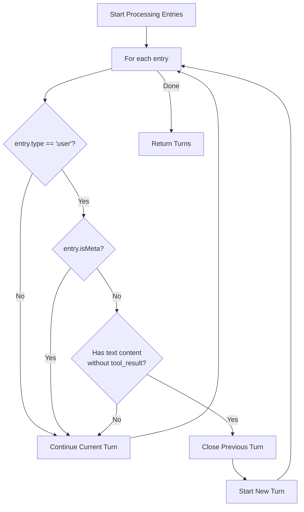
```mermaid
flowchart TD
    Start[Start Processing Entries]
    Loop[For each entry]
    CheckType{entry.type == 'user'?}
    CheckMeta{entry.isMeta?}
    CheckContent{Has text content<br/>without tool_result?}
    StartTurn[Start New Turn]
    Continue[Continue Current Turn]
    ClosePrev[Close Previous Turn]
    End[Return Turns]

    Start --> Loop
    Loop --> CheckType
    CheckType -->|No| Continue
    CheckType -->|Yes| CheckMeta
    CheckMeta -->|Yes| Continue
    CheckMeta -->|No| CheckContent
    CheckContent -->|No| Continue
    CheckContent -->|Yes| ClosePrev
    ClosePrev --> StartTurn
    StartTurn --> Loop
    Continue --> Loop
    Loop -->|Done| End
```

## 4.7 Compression Band Mapping

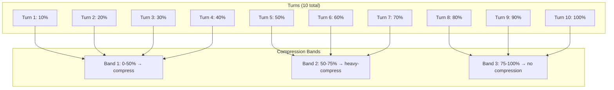
```mermaid
graph TB
    subgraph "Compression Bands"
        Band1[Band 1: 0-50% → compress]
        Band2[Band 2: 50-75% → heavy-compress]
        Band3[Band 3: 75-100% → no compression]
    end

    subgraph "Turns (10 total)"
        T1[Turn 1: 10%]
        T2[Turn 2: 20%]
        T3[Turn 3: 30%]
        T4[Turn 4: 40%]
        T5[Turn 5: 50%]
        T6[Turn 6: 60%]
        T7[Turn 7: 70%]
        T8[Turn 8: 80%]
        T9[Turn 9: 90%]
        T10[Turn 10: 100%]
    end

    T1 --> Band1
    T2 --> Band1
    T3 --> Band1
    T4 --> Band1
    T5 --> Band2
    T6 --> Band2
    T7 --> Band2
    T8 --> Band3
    T9 --> Band3
    T10 --> Band3
```

## 4.8 LLM Provider Abstraction

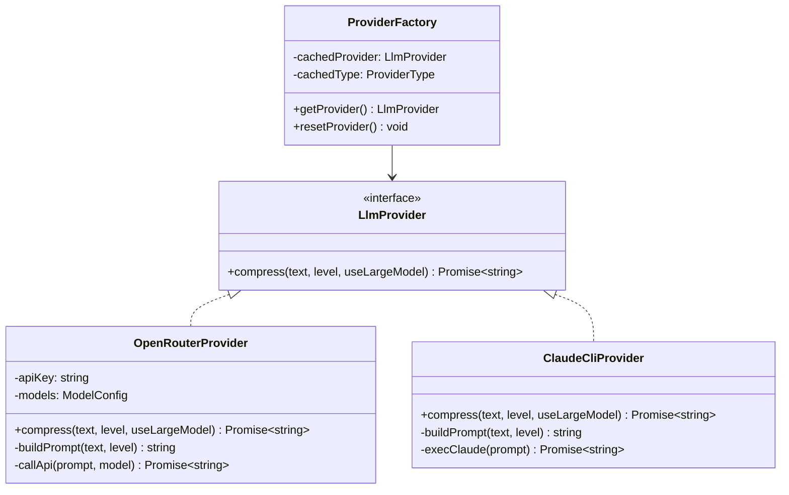
```mermaid
classDiagram
    class LlmProvider {
        <<interface>>
        +compress(text, level, useLargeModel) Promise~string~
    }

    class OpenRouterProvider {
        -apiKey: string
        -models: ModelConfig
        +compress(text, level, useLargeModel) Promise~string~
        -buildPrompt(text, level) string
        -callApi(prompt, model) Promise~string~
    }

    class ClaudeCliProvider {
        +compress(text, level, useLargeModel) Promise~string~
        -buildPrompt(text, level) string
        -execClaude(prompt) Promise~string~
    }

    class ProviderFactory {
        -cachedProvider: LlmProvider
        -cachedType: ProviderType
        +getProvider() LlmProvider
        +resetProvider() void
    }

    LlmProvider <|.. OpenRouterProvider
    LlmProvider <|.. ClaudeCliProvider
    ProviderFactory --> LlmProvider
```

## 4.9 Batch Processing State Machine

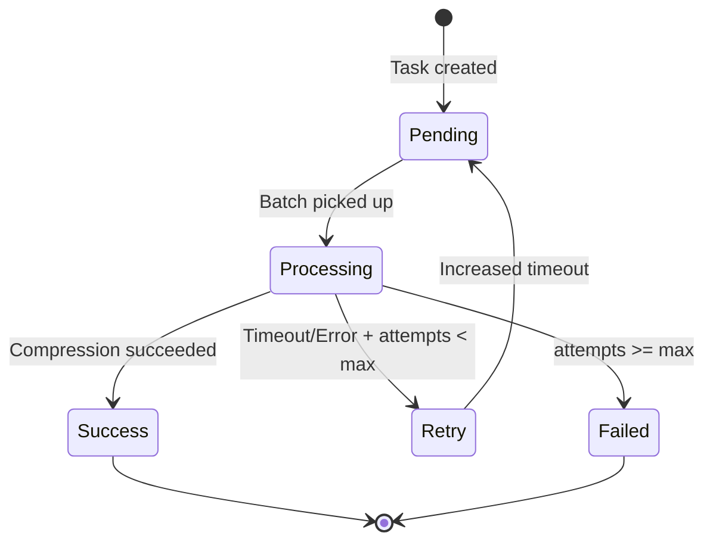
```mermaid
stateDiagram-v2
    [*] --> Pending: Task created
    Pending --> Processing: Batch picked up
    Processing --> Success: Compression succeeded
    Processing --> Retry: Timeout/Error + attempts < max
    Retry --> Pending: Increased timeout
    Processing --> Failed: attempts >= max
    Success --> [*]
    Failed --> [*]
```

## 4.10 Removal Algorithm

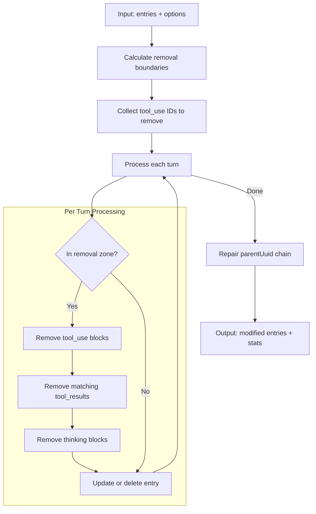
```mermaid
flowchart TD
    Start[Input: entries + options]
    CalcBounds[Calculate removal boundaries]
    CollectIDs[Collect tool_use IDs to remove]
    ProcessTurns[Process each turn]

    subgraph "Per Turn Processing"
        CheckZone{In removal zone?}
        RemoveTool[Remove tool_use blocks]
        RemoveResult[Remove matching tool_results]
        RemoveThinking[Remove thinking blocks]
        UpdateEntry[Update or delete entry]
    end

    RepairChain[Repair parentUuid chain]
    Output[Output: modified entries + stats]

    Start --> CalcBounds
    CalcBounds --> CollectIDs
    CollectIDs --> ProcessTurns
    ProcessTurns --> CheckZone
    CheckZone -->|Yes| RemoveTool
    RemoveTool --> RemoveResult
    RemoveResult --> RemoveThinking
    RemoveThinking --> UpdateEntry
    CheckZone -->|No| UpdateEntry
    UpdateEntry --> ProcessTurns
    ProcessTurns -->|Done| RepairChain
    RepairChain --> Output
```

---

# 5. Session Visualization

## 5.1 Overview

Session visualization provides insights into token consumption patterns through multiple visualization modes.

```mermaid
graph TB
    subgraph "Visualization Types"
        Stack[Stack Visualization]
        Detail[Session Detail]
        Playback[Turn Playback]
    end

    Session[Session Data] --> Stack
    Session --> Detail
    Detail --> Playback
```

## 5.2 API Endpoints

| Method | Endpoint | Description |
|--------|----------|-------------|
| GET | `/api/session-structure/:id` | Token structure for stack viz |
| GET | `/api/session/:id/turns` | Turn-by-turn data |
| GET | `/visualize` | Stack visualization page |
| GET | `/session-detail` | Detailed turn view page |

## 5.3 Session Structure Service

```mermaid
classDiagram
    class SessionStructureService {
        +getSessionStructure(sessionId) Promise~SessionStructure~
        -processEntry(entry, indexRef) StructureEntry[]
        -processArrayContent(content, type, ref) StructureEntry[]
        -classifyBlock(block) BlockType
        -getBlockText(block) string
        -mapToEntryType(blockType, parentType) StructureEntryType
    }

    class SessionStructure {
        +sessionId: string
        +totalTokens: number
        +maxEntryTokens: number
        +entries: StructureEntry[]
    }

    class StructureEntry {
        +index: number
        +type: "user"|"assistant"|"tool"|"thinking"
        +tokens: number
    }

    SessionStructureService --> SessionStructure
    SessionStructure --> StructureEntry
```

## 5.4 Session Turns Service

```mermaid
classDiagram
    class SessionTurnsService {
        +getSessionTurns(sessionId) Promise~SessionTurnsResponse~
        +calculateCumulativeTokens(entries, turns, upToIndex) TokensByType
        +extractTurnContent(entries, turn) TurnContent
        +classifyBlock(block) BlockType
    }

    class SessionTurnsResponse {
        +sessionId: string
        +totalTurns: number
        +turns: TurnData[]
    }

    class TurnData {
        +turnIndex: number
        +cumulative: TokensByType
        +content: TurnContent
    }

    class TokensByType {
        +user: number
        +assistant: number
        +thinking: number
        +tool: number
        +total: number
    }

    class TurnContent {
        +userPrompt: string
        +toolBlocks: ToolBlock[]
        +toolResults?: ToolBlock[]
        +thinking?: string
        +assistantResponse: string
    }

    SessionTurnsService --> SessionTurnsResponse
    SessionTurnsResponse --> TurnData
    TurnData --> TokensByType
    TurnData --> TurnContent
```

## 5.5 Session Structure Sequence

```mermaid
sequenceDiagram
    participant Client
    participant Router as sessionStructureRouter
    participant Service as SessionStructureService
    participant Clone as SessionCloneService
    participant Compress as CompressionService
    participant FS as File System

    Client->>Router: GET /api/session-structure/:id
    Router->>Service: getSessionStructure(sessionId)
    Service->>Clone: findSessionFile(sessionId)
    Clone->>FS: Search projects
    FS-->>Clone: sessionPath
    Clone-->>Service: sessionPath

    Service->>FS: readFile(sessionPath)
    FS-->>Service: JSONL content

    Service->>Clone: parseSession(content)
    Clone-->>Service: SessionEntry[]

    loop For each entry
        Service->>Service: processEntry(entry, indexRef)

        alt Array content with mixed types
            Service->>Service: processArrayContent()
            loop For each block
                Service->>Service: classifyBlock()
                Service->>Compress: estimateTokens(text)
                Compress-->>Service: tokenCount
            end
            Service->>Service: Emit grouped StructureEntry
        else Simple content
            Service->>Compress: estimateTokens(text)
            Service->>Service: Create single StructureEntry
        end
    end

    Service->>Service: Calculate totals
    Service-->>Router: SessionStructure
    Router-->>Client: JSON response
```

## 5.6 Session Turns Sequence

```mermaid
sequenceDiagram
    participant Client
    participant Router as sessionTurnsRouter
    participant Service as SessionTurnsService
    participant Clone as SessionCloneService
    participant FS as File System

    Client->>Router: GET /api/session/:id/turns
    Router->>Service: getSessionTurns(sessionId)

    Service->>Clone: findSessionFile(sessionId)
    Clone-->>Service: sessionPath

    Service->>FS: readFile(sessionPath)
    FS-->>Service: content

    Service->>Clone: parseSession(content)
    Clone-->>Service: SessionEntry[]

    Service->>Clone: identifyTurns(entries)
    Clone-->>Service: Turn[]

    loop For each turn index
        Service->>Service: calculateCumulativeTokens(entries, turns, idx)
        Note over Service: Iterate entries 0..turnEnd<br/>Classify blocks, sum tokens

        Service->>Service: extractTurnContent(entries, turn)
        Note over Service: Extract userPrompt,<br/>toolBlocks, thinking,<br/>assistantResponse

        Service->>Service: Build TurnData
    end

    Service-->>Router: SessionTurnsResponse
    Router-->>Client: JSON response
```

## 5.7 Token Counting Algorithm

```mermaid
flowchart TD
    Start[calculateCumulativeTokens]
    InitBuckets[Initialize: user=0, assistant=0, thinking=0, tool=0]

    Loop[For each turn 0 to upToTurnIndex]
    GetTurn[Get turn boundary]

    EntryLoop[For each entry in turn]
    SkipCheck{Skip entry?<br/>isMeta/summary/etc}

    ContentType{Content type?}
    StringContent[String: estimate tokens]
    ArrayContent[Array: process blocks]

    BlockLoop[For each block]
    BlockType{Block type?}
    AddUser[Add to user bucket]
    AddAssistant[Add to assistant bucket]
    AddTool[Add to tool bucket]
    AddThinking[Add to thinking bucket]

    CalcTotal[total = user + assistant + thinking + tool]
    Return[Return TokensByType]

    Start --> InitBuckets --> Loop
    Loop --> GetTurn --> EntryLoop
    EntryLoop --> SkipCheck
    SkipCheck -->|Yes| EntryLoop
    SkipCheck -->|No| ContentType
    ContentType -->|string| StringContent
    ContentType -->|array| ArrayContent
    StringContent --> EntryLoop
    ArrayContent --> BlockLoop
    BlockLoop --> BlockType
    BlockType -->|text user| AddUser
    BlockType -->|text assistant| AddAssistant
    BlockType -->|tool_use/result| AddTool
    BlockType -->|thinking| AddThinking
    AddUser --> BlockLoop
    AddAssistant --> BlockLoop
    AddTool --> BlockLoop
    AddThinking --> BlockLoop
    BlockLoop -->|Done| EntryLoop
    EntryLoop -->|Done| Loop
    Loop -->|Done| CalcTotal --> Return
```

---

# 6. UI Pages

## 6.1 Session Browser Page

### 6.1.1 Page Architecture

```mermaid
graph TB
    subgraph "Session Browser Page"
        Header[Project Dropdown]
        Table[Session Table]
        Actions[Row Actions]
    end

    subgraph "Components"
        Loading[Loading Indicator]
        Empty[Empty State]
        Error[Error Message]
        Toast[Toast Notification]
    end

    subgraph "Controllers"
        Controller[SessionBrowserController]
    end

    Controller --> Header
    Controller --> Table
    Controller --> Actions
    Controller --> Loading
    Controller --> Empty
    Controller --> Error
    Controller --> Toast
```

### 6.1.2 Page Controller Class

```mermaid
classDiagram
    class SessionBrowserController {
        -projectSelect: HTMLSelectElement
        -sessionTableContainer: HTMLElement
        -sessionBody: HTMLElement
        -loadingIndicator: HTMLElement
        -emptyMessage: HTMLElement
        -errorMessage: HTMLElement
        -toast: HTMLElement
        -currentSort: SortConfig
        -sessions: SessionSummary[]
        -lastSelectedFolder: string

        +init() Promise~void~
        +loadProjects() Promise~void~
        +renderProjectDropdown(projects) void
        +loadSessions(folder) Promise~void~
        +sortAndRender() void
        +renderSessionTable(sessions) void
        +setupEventListeners() void
        +copySessionId(sessionId) Promise~void~
        +updateSortIndicators() void
        -showLoading(show) void
        -showTable() void
        -hideTable() void
        -showEmpty(message) void
        -hideEmpty() void
        -showError(message) void
        -hideError() void
        -showToast(message) void
    }

    class SortConfig {
        +field: string
        +order: "asc"|"desc"
    }

    SessionBrowserController --> SortConfig
```

### 6.1.3 Event Flow

```mermaid
sequenceDiagram
    participant User
    participant DOM
    participant Controller as SessionBrowserController
    participant API as SessionBrowserClient

    Note over Controller: Page Load
    Controller->>Controller: init()
    Controller->>API: fetchProjects()
    API-->>Controller: projects[]
    Controller->>DOM: renderProjectDropdown()

    User->>DOM: Select project
    DOM->>Controller: change event
    Controller->>Controller: loadSessions(folder)
    Controller->>DOM: showLoading(true)
    Controller->>API: fetchSessions(folder)
    API-->>Controller: sessions[]
    Controller->>DOM: showLoading(false)
    Controller->>Controller: sortAndRender()
    Controller->>DOM: renderSessionTable()

    User->>DOM: Click column header
    DOM->>Controller: click event
    Controller->>Controller: Update currentSort
    Controller->>Controller: sortAndRender()

    User->>DOM: Click Clone button
    DOM->>Controller: click event
    Controller->>DOM: Navigate to /session-clone?sessionId=...
```

## 6.2 Clone Page

### 6.2.1 Page Architecture

```mermaid
graph TB
    subgraph "Clone Page"
        Form[Clone Form]
        SessionInput[Session ID Input]
        RemovalOptions[Removal Options]
        CompressionOptions[Compression Options]
        SubmitBtn[Submit Button]
        Results[Result Display]
    end

    subgraph "Sub-components"
        ToolRemoval[Tool Removal Select]
        ThinkingRemoval[Thinking Removal Select]
        Band1[Band 1 Input]
        Band2[Band 2 Input]
        BandPreview[Band Preview]
        DebugLog[Debug Log Checkbox]
    end

    Form --> SessionInput
    Form --> RemovalOptions
    Form --> CompressionOptions
    Form --> SubmitBtn

    RemovalOptions --> ToolRemoval
    RemovalOptions --> ThinkingRemoval

    CompressionOptions --> Band1
    CompressionOptions --> Band2
    CompressionOptions --> BandPreview
    CompressionOptions --> DebugLog
```

### 6.2.2 Clone Form Flow

```mermaid
sequenceDiagram
    participant User
    participant Form
    participant Validation as ValidationLib
    participant Compression as CompressionLib
    participant API as ApiClient
    participant UI as UIComponents

    Note over Form: Page Load
    Form->>Form: Check URL params
    Form->>Form: Pre-fill sessionId if present

    User->>Form: Input band values
    Form->>Compression: validateBands(band1, band2)
    Compression-->>Form: { valid, errors }
    Form->>Compression: formatBandPreview(band1, band2)
    Form->>Form: Update preview & error display

    User->>Form: Click Submit
    Form->>Validation: validateUUID(sessionId)
    Validation-->>Form: boolean

    alt Invalid UUID
        Form->>UI: showError("Invalid session ID")
    else Valid UUID
        Form->>UI: showLoading()
        Form->>Compression: buildCompressionBands(band1, band2)
        Compression-->>Form: CompressionBand[]
        Form->>API: post('/api/v2/clone', request)

        alt Success
            API-->>Form: CloneResponse
            Form->>UI: hideLoading()
            Form->>UI: showSuccess(response)
            Form->>Form: Display compression stats
            Form->>Form: Show debug log link if enabled
        else Error
            API-->>Form: ApiError
            Form->>UI: hideLoading()
            Form->>UI: showError(error.message)
        end
    end
```

### 6.2.3 Client-Side Modules

```mermaid
classDiagram
    class ClonePage {
        -form: HTMLFormElement
        -containers: ContainerMap
        -bandInputs: InputElements
        -isSubmitting: boolean
        +handleSubmit(e) Promise
        +handleCopy() Promise
        +updateBandValidation() void
        +openDebugLog(path) void
    }

    class ValidationLib {
        +validateUUID(str) boolean
    }

    class TransformsLib {
        +extractSessionId(path) string
        +formatStats(stats) FormattedStats
        +formatCompressionStats(stats) StatItem[]
    }

    class CompressionLib {
        +validateBands(band1, band2) ValidationResult
        +buildCompressionBands(band1, band2) CompressionBand[]
        +formatBandPreview(band1, band2) string
    }

    class ApiClient {
        +get(url) Promise
        +post(url, body) Promise
    }

    class LoadingUI {
        +showLoading(el, msg) void
        +hideLoading(el) void
        +setSubmitDisabled(btn, disabled) void
    }

    class NotificationsUI {
        +hideAll(containers) void
        +showSuccess(el, data) void
        +showError(el, message) void
    }

    ClonePage --> ValidationLib
    ClonePage --> TransformsLib
    ClonePage --> CompressionLib
    ClonePage --> ApiClient
    ClonePage --> LoadingUI
    ClonePage --> NotificationsUI
```

## 6.3 Session Detail Page

### 6.3.1 Page Architecture

```mermaid
graph TB
    subgraph "Session Detail Page"
        Input[Session Input]
        Navigation[Turn Navigation]
        Visualization[Token Visualization]
        DetailCard[Turn Detail Card]
        TurnRail[Turn Rail]
        PlaybackControls[Playback Controls]
    end

    subgraph "Navigation Components"
        LeftBtn[Left Button]
        TurnInput[Turn Input]
        RightBtn[Right Button]
        Slider[Turn Slider]
        TurnLabel[Turn Label]
    end

    subgraph "Playback"
        PlayBtn[Play/Pause]
        ResetBtn[Reset]
        SpeedSelect[Speed Select]
    end

    Navigation --> LeftBtn
    Navigation --> TurnInput
    Navigation --> RightBtn
    Navigation --> Slider
    Navigation --> TurnLabel

    PlaybackControls --> PlayBtn
    PlaybackControls --> ResetBtn
    PlaybackControls --> SpeedSelect
```

### 6.3.2 Session Detail Controller

```mermaid
classDiagram
    class SessionDetailController {
        -sessionData: SessionTurnsResponse
        -currentTurn: number
        -currentScale: number
        -isPlaying: boolean
        -playIntervalId: number

        +init() void
        +handleLoad() Promise~void~
        +handleLeftClick() void
        +handleRightClick() void
        +handleTurnInputChange() void
        +handleSliderChange() void
        +handleScaleInputChange() void
        +handlePlayPause() void
        +handleReset() void
        +handleSpeedChange() void
        -syncNavigation() void
        -renderVisualization() void
        -renderDetailCard() void
        -renderTurnRail() void
        -checkScaleWarning() void
        -startPlayback() void
        -stopPlayback() void
    }

    class D3Visualization {
        +renderStackedArea(data, container, config) void
    }

    class SessionDetailLib {
        +COLORS: ColorMap
        +formatTokenCount(n) string
        +truncateToolContent(text, lines) string
        +exceedsScale(cumulative, scale) boolean
        +validateScaleInput(value) number
        +validateTurnInput(value, total) number
    }

    SessionDetailController --> D3Visualization
    SessionDetailController --> SessionDetailLib
```

### 6.3.3 Visualization Rendering

```mermaid
sequenceDiagram
    participant Controller
    participant D3 as D3.js
    participant Container as DOM Container

    Controller->>Controller: renderVisualization()
    Controller->>Controller: Slice turns[0..currentTurn]
    Controller->>Controller: Prepare data array

    Controller->>D3: stack().keys(["user", "assistant", "thinking", "tool"])
    D3-->>Controller: stack generator

    Controller->>D3: scaleLinear().domain([0, xMax])
    D3-->>Controller: xScale

    Controller->>D3: scaleLinear().domain([0, maxTokens])
    D3-->>Controller: yScale

    Controller->>D3: area().curve(curveMonotoneX)
    D3-->>Controller: area generator

    Controller->>D3: select(container).append("svg")
    Controller->>D3: append("g") with transform

    loop For each series layer
        Controller->>D3: append("path").datum(layer)
        Controller->>D3: attr("fill", COLORS[layer.key])
        Controller->>D3: attr("d", area)
    end

    Controller->>Container: Update tokenStats text
```

### 6.3.4 Playback State Machine

```mermaid
stateDiagram-v2
    [*] --> Stopped: Initial

    Stopped --> Playing: Play clicked
    Playing --> Stopped: Pause clicked
    Playing --> Stopped: Reached end
    Playing --> Stopped: Reset clicked

    Stopped --> Stopped: Reset clicked

    state Playing {
        [*] --> Advancing
        Advancing --> Advancing: Interval tick
        Advancing --> [*]: currentTurn >= totalTurns-1
    }

    note right of Playing
        Button shows "⏸"
        Interval running at selected speed
    end note

    note right of Stopped
        Button shows "▶"
        No interval running
    end note
```

---

# 7. Testing Framework

## 7.1 Test Strategy Overview

```mermaid
graph TB
    subgraph "Test Pyramid"
        E2E[Integration Tests]
        Service[Service Tests]
        Unit[Unit Tests]
    end

    subgraph "Test Types"
        Backend[Backend TypeScript]
        Frontend[Frontend JavaScript]
        UI[UI Component Tests]
    end

    Unit --> Service --> E2E

    Backend --> Unit
    Backend --> Service
    Backend --> E2E
    Frontend --> Unit
    UI --> Unit
```

## 7.2 Testing Stack

| Component | Tool | Configuration |
|-----------|------|---------------|
| Test Runner | Vitest 3.2 | `vitest.config.ts` |
| Assertions | Vitest built-in | Global mode |
| DOM Testing | jsdom 27 | Environment glob matching |
| Mocking | Vitest vi | Function/module mocking |

## 7.3 Vitest Configuration

```mermaid
graph LR
    subgraph "Test Environments"
        Node[Node Environment<br/>Default for *.test.ts]
        JSDOM[jsdom Environment<br/>test/js/ui/**]
    end

    subgraph "Test Files"
        TS[test/**/*.test.ts]
        JS[test/**/*.test.js]
    end

    TS --> Node
    JS --> Node
    JS -->|ui tests| JSDOM
```

## 7.4 Test File Organization

```
test/
├── fixtures/                      # Test data
│   └── session-browser/           # Browser test fixtures
│       └── projects/
│           ├── -Users-test-projectalpha/
│           │   └── 11111111-...jsonl
│           └── -Users-test-edgecases/
│               └── ...
├── helpers/                       # Test utilities
├── js/                            # Frontend tests
│   ├── lib/                       # Pure function tests
│   │   └── format.test.js
│   └── ui/                        # UI component tests (jsdom)
├── providers/                     # Provider tests
│   ├── claude-cli-provider.test.ts
│   ├── openrouter-provider.test.ts
│   └── provider-factory.test.ts
├── clone.test.ts                  # V1 clone tests
├── clone-v2-integration.test.ts   # V2 integration tests
├── compression-batch.test.ts      # Batch processor tests
├── compression-core.test.ts       # Compression logic tests
├── session-browser.test.ts        # Browser source tests
├── session-browser-integration.test.ts
├── session-turns.test.ts          # Turns service tests
└── openrouter-client.test.ts      # Legacy client tests
```

## 7.5 TDD Workflow Support

```mermaid
sequenceDiagram
    participant Dev as Developer
    participant Red as Red Phase
    participant Green as Green Phase
    participant Refactor as Refactor Phase

    Dev->>Red: Write failing tests
    Note over Red: Tests throw NotImplementedError<br/>or fail assertions

    Red->>Green: Implement code
    Note over Green: Write minimum code<br/>to pass tests

    Green->>Refactor: Improve code
    Note over Refactor: Maintain passing tests<br/>while improving design

    Refactor->>Dev: Commit changes
```

## 7.6 Test Categories

### 7.6.1 Unit Tests

```mermaid
classDiagram
    class UnitTestPatterns {
        +testPureFunctions()
        +testValidation()
        +testTransformations()
        +testTokenEstimation()
    }

    note for UnitTestPatterns "No external dependencies\nFast execution\nIsolated assertions"
```

**Examples:**
- `decodeFolderName()` - Path decoding
- `truncateMessage()` - String truncation
- `estimateTokens()` - Token counting
- `validateBands()` - Input validation

### 7.6.2 Service Tests

```mermaid
classDiagram
    class ServiceTestPatterns {
        +testWithMockedFS()
        +testWithMockedProvider()
        +testErrorHandling()
        +testEdgeCases()
    }

    note for ServiceTestPatterns "Mock file system\nMock external APIs\nTest business logic"
```

**Examples:**
- `ClaudeSessionSource.listProjects()` - With fixture directory
- `compressWithTimeout()` - With mock provider
- `identifyTurns()` - With sample session data

### 7.6.3 Integration Tests

```mermaid
classDiagram
    class IntegrationTestPatterns {
        +testFullAPIFlow()
        +testWithRealServer()
        +testEndToEnd()
    }

    note for IntegrationTestPatterns "Start test server\nReal HTTP requests\nFixture data"
```

**Examples:**
- `GET /api/projects` - Full route test
- `POST /api/v2/clone` - Clone integration
- Session browser router tests

## 7.7 Session Browser Test Structure

```mermaid
graph TB
    subgraph "Test Suite: Session Browser"
        UtilTests[Utility Function Tests]
        SourceTests[ClaudeSessionSource Tests]
        RouterTests[Router Integration Tests]
    end

    subgraph "Utility Tests"
        Decode[decodeFolderName tests]
        Encode[encodeFolderPath tests]
        Truncate[truncateMessage tests]
    end

    subgraph "Source Tests"
        Available[isAvailable tests]
        ListProjects[listProjects tests]
        ListSessions[listSessions tests]
        EdgeCases[Edge case tests]
    end

    subgraph "Router Tests"
        GetProjects[GET /api/projects]
        GetSessions[GET /api/projects/:folder/sessions]
        ErrorCases[Error handling]
    end

    UtilTests --> Decode
    UtilTests --> Encode
    UtilTests --> Truncate

    SourceTests --> Available
    SourceTests --> ListProjects
    SourceTests --> ListSessions
    SourceTests --> EdgeCases

    RouterTests --> GetProjects
    RouterTests --> GetSessions
    RouterTests --> ErrorCases
```

## 7.8 Test Fixtures

```mermaid
graph TB
    subgraph "Fixture Structure"
        Root[test/fixtures/session-browser/projects/]
        Alpha[-Users-test-projectalpha/]
        Beta[-Users-test-projectbeta/]
        Empty[-Users-test-emptyproject/]
        Edge[-Users-test-edgecases/]
    end

    subgraph "Alpha Sessions"
        A1[11111111-...jsonl<br/>2 turns, tool usage]
        A2[22222222-...jsonl<br/>Simple session]
    end

    subgraph "Edge Case Sessions"
        E1[aaaaaaaa-...jsonl<br/>No user messages]
        E2[bbbbbbbb-...jsonl<br/>Malformed lines]
        E3[cccccccc-...jsonl<br/>Very long message]
    end

    Root --> Alpha
    Root --> Beta
    Root --> Empty
    Root --> Edge

    Alpha --> A1
    Alpha --> A2

    Edge --> E1
    Edge --> E2
    Edge --> E3
```

## 7.9 Compression Test Patterns

```mermaid
sequenceDiagram
    participant Test
    participant Mock as Mock Provider
    participant Service as CompressionService
    participant Batch as BatchService

    Note over Test: Setup
    Test->>Mock: Create mock LlmProvider
    Mock->>Mock: Define compress() behavior

    Note over Test: Test Execution
    Test->>Service: compressMessages(entries, turns, bands, config)
    Service->>Batch: processBatches(tasks, mockProvider, config)

    loop For each task
        Batch->>Mock: compress(text, level, useLargeModel)
        Mock-->>Batch: "compressed text"
    end

    Batch-->>Service: CompressionTask[]
    Service-->>Test: { entries, stats, tasks }

    Note over Test: Assertions
    Test->>Test: Verify stats.messagesCompressed
    Test->>Test: Verify entry content replaced
    Test->>Test: Verify task statuses
```

## 7.10 Frontend Test Patterns

### 7.10.1 Pure Library Tests (Node Environment)

```mermaid
graph LR
    subgraph "test/js/lib/format.test.js"
        Import[Import functions]
        Test1[Test formatRelativeTime]
        Test2[Test formatFileSize]
        Test3[Test escapeHtml]
    end

    Import --> Test1
    Import --> Test2
    Import --> Test3
```

### 7.10.2 UI Component Tests (jsdom Environment)

```mermaid
graph TB
    subgraph "UI Test Setup"
        JSDOM[jsdom environment]
        Document[Mock document]
        DOM[Create test DOM]
    end

    subgraph "Test Execution"
        Import[Import UI module]
        Setup[Setup DOM elements]
        Call[Call UI function]
        Assert[Assert DOM changes]
    end

    JSDOM --> Document
    Document --> DOM
    DOM --> Import
    Import --> Setup
    Setup --> Call
    Call --> Assert
```

---

# 8. Appendices

## 8.1 Session Entry Type Reference

```mermaid
classDiagram
    class SessionEntry {
        +type: string
        +uuid?: string
        +parentUuid?: string
        +sessionId?: string
        +isMeta?: boolean
        +message?: Message
    }

    class Message {
        +role?: string
        +content?: ContentBlock[] | string
        +stop_reason?: string
    }

    class ContentBlock {
        +type: string
        +text?: string
        +thinking?: string
        +id?: string
        +name?: string
        +input?: object
        +tool_use_id?: string
        +content?: string
    }

    SessionEntry --> Message
    Message --> ContentBlock
```

## 8.2 Entry Types

| Type | Description | Has Content |
|------|-------------|-------------|
| `user` | User message | Yes |
| `assistant` | Assistant response | Yes |
| `summary` | Session summary | No (sessionId=null) |
| `file-history-snapshot` | File state | No (sessionId=null) |
| `queue-operation` | Internal operation | No |
| `system` | System message | Yes (isMeta=true) |

## 8.3 Content Block Types

| Block Type | Parent Entry | Description |
|------------|--------------|-------------|
| `text` | user/assistant | Text content |
| `thinking` | assistant | Extended thinking |
| `tool_use` | assistant | Tool invocation |
| `tool_result` | user | Tool response |
| `image` | user | Image content |

## 8.4 Configuration Reference

```mermaid
graph LR
    subgraph "Environment Variables"
        PORT[PORT=3000]
        CLAUDE_DIR[CLAUDE_DIR=~/.claude]
        LLM_PROVIDER[LLM_PROVIDER=openrouter]
        OPENROUTER_KEY[OPENROUTER_API_KEY]
    end

    subgraph "Compression Config"
        CONC[COMPRESSION_CONCURRENCY=3]
        TIMEOUT[COMPRESSION_TIMEOUT_INITIAL=20000]
        MAX[COMPRESSION_MAX_ATTEMPTS=3]
        MIN[COMPRESSION_MIN_TOKENS=30]
    end
```

## 8.5 API Route Summary

| Method | Route | Handler | Service |
|--------|-------|---------|---------|
| GET | `/` | sessionBrowserRouter | - |
| GET | `/session-clone` | sessionBrowserRouter | - |
| GET | `/visualize` | server.ts | - |
| GET | `/session-detail` | server.ts | - |
| GET | `/api/projects` | sessionBrowserRouter | ClaudeSessionSource |
| GET | `/api/projects/:folder/sessions` | sessionBrowserRouter | ClaudeSessionSource |
| POST | `/api/clone` | cloneRouter | SessionCloneService |
| POST | `/api/v2/clone` | cloneRouterV2 | SessionCloneService + CompressionService |
| GET | `/api/session-structure/:id` | sessionStructureRouter | SessionStructureService |
| GET | `/api/session/:id/turns` | sessionTurnsRouter | SessionTurnsService |
| GET | `/health` | server.ts | - |

---

*Document generated for Claude Code Session Manager v1.0*
