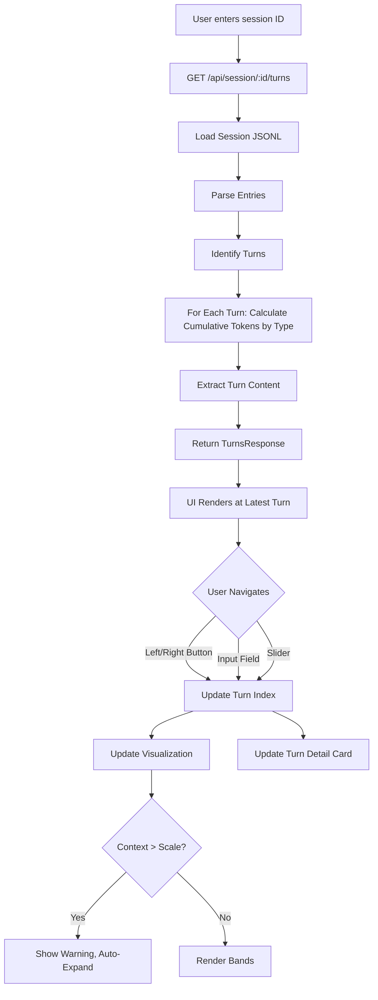
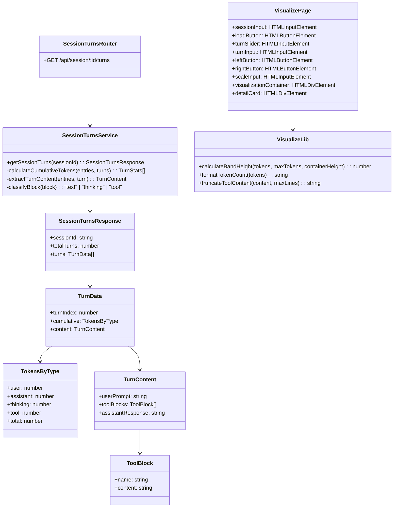
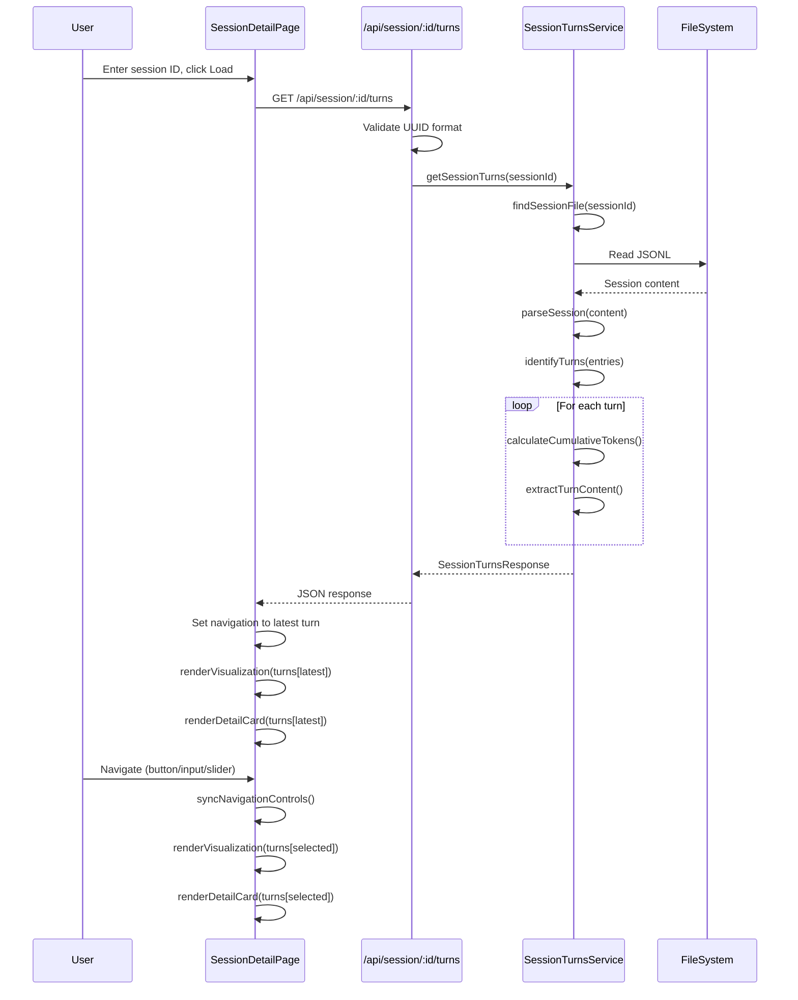

# Tech Design: Session Detail Core

## 1. Feature Summary

### Overview

This feature provides a turn-by-turn context visualization for Claude Code sessions. Users can navigate through turns and see how cumulative context (measured in tokens) is distributed across content types: User messages, Assistant responses, Thinking blocks, and Tool operations. This enables informed decisions about context management.

### Functional Description

When a user navigates to `/session-detail` and enters a session ID:

1. The API loads the session JSONL and organizes it by turns
2. For each turn, it calculates cumulative token counts by type (user, assistant, thinking, tool)
3. The UI displays the session at the latest turn
4. The user can navigate to any turn using buttons, input field, or slider
5. The visualization shows 4 vertical bands representing cumulative tokens by type
6. A scale input sets the maximum token bound (50k-2000k)
7. If context exceeds the scale, it auto-expands with a warning
8. Below the visualization, a markdown card shows the selected turn's content

The visualization answers: "At turn N, how full is my context window, and what's consuming it?"

---

## 2. Tech Overview

### Data Flow Diagram



### Process Steps

1. **Request Validation** - Validate session ID as UUID format

2. **Load Session** - Use existing `findSessionFile()` to locate session JSONL

3. **Parse Session** - Use existing `parseSession()` to convert JSONL to entries

4. **Identify Turns** - Use existing `identifyTurns()` to detect turn boundaries

5. **Calculate Cumulative Tokens** - For each turn, sum tokens by type from turn 0 through that turn

6. **Extract Turn Content** - For each turn, extract user prompt, tool blocks, and assistant response

7. **Return Response** - Return structured data with turns array containing cumulative stats and content

8. **UI Render** - Display visualization at latest turn with synced navigation controls

9. **Navigation Updates** - On navigation change, update visualization and detail card

---

## 3. Module Architecture

### UML Class/Module Diagram



### Module Descriptions

- **SessionTurnsRouter** (`src/routes/session-turns.ts`) - Express router for turns endpoint. Validates request, calls service, formats response.

- **SessionTurnsService** (`src/services/session-turns.ts`) - Loads session, calculates cumulative tokens by type per turn, extracts turn content.

- **SessionTurnsResponse** (`src/types.ts`) - Response type with turns array containing cumulative stats and content.

- **VisualizePage** (`public/js/pages/session-detail.js`) - Page orchestration: form handling, navigation sync, D3 rendering, card updates.

- **VisualizeLib** (`public/js/lib/session-detail.js`) - Pure functions: band height calculation, token formatting, tool content truncation.

---

## 4. Sequence Diagram



---

## 5. Method Inventory

### New Types (`src/types.ts`)

```typescript
// Tokens grouped by content type
interface TokensByType {
  user: number;
  assistant: number;
  thinking: number;
  tool: number;
  total: number;
}

// Tool block extracted from turn
interface ToolBlock {
  name: string;      // Tool name (e.g., "read_file")
  content: string;   // Full tool content (truncated in UI)
}

// Content extracted from a turn
interface TurnContent {
  userPrompt: string;
  toolBlocks: ToolBlock[];
  assistantResponse: string;
}

// Full turn data including cumulative stats and content
interface TurnData {
  turnIndex: number;
  cumulative: TokensByType;    // Cumulative tokens from turn 0 through this turn
  content: TurnContent;
}

// API response
interface SessionTurnsResponse {
  sessionId: string;
  totalTurns: number;
  turns: TurnData[];
}
```

### New Schema (inline in `src/routes/session-turns.ts`)

**Note:** Following existing pattern in `session-structure.ts`, define schemas inline in the router file rather than a separate schema file. This keeps related code together.

```typescript
// Route params validation
const SessionIdParamsSchema = z.object({
  id: z.string().regex(
    /^[0-9a-f]{8}-[0-9a-f]{4}-[0-9a-f]{4}-[0-9a-f]{4}-[0-9a-f]{12}$/i,
    "Invalid session ID format"
  )
});

// Response schema
const TokensByTypeSchema = z.object({
  user: z.number(),
  assistant: z.number(),
  thinking: z.number(),
  tool: z.number(),
  total: z.number(),
});

const ToolBlockSchema = z.object({
  name: z.string(),
  content: z.string(),
});

const TurnContentSchema = z.object({
  userPrompt: z.string(),
  toolBlocks: z.array(ToolBlockSchema),
  assistantResponse: z.string(),
});

const TurnDataSchema = z.object({
  turnIndex: z.number(),
  cumulative: TokensByTypeSchema,
  content: TurnContentSchema,
});

const SessionTurnsResponseSchema = z.object({
  sessionId: z.string(),
  totalTurns: z.number(),
  turns: z.array(TurnDataSchema),
});
```

### New Service (`src/services/session-turns.ts`)

```typescript
import { findSessionFile, parseSession, identifyTurns } from "./session-clone.js";
import { estimateTokens } from "./compression.js";

async function getSessionTurns(sessionId: string): Promise<SessionTurnsResponse>
// 1. Find and load session file
// 2. Parse entries
// 3. Identify turns
// 4. For each turn, calculate cumulative tokens and extract content
// 5. Return response

function calculateCumulativeTokens(
  entries: SessionEntry[],
  turns: Turn[],
  upToTurnIndex: number
): TokensByType
// Sum tokens by type from turn 0 through upToTurnIndex
// For each entry in range:
//   - Classify entry/blocks into types (user, assistant, thinking, tool)
//   - Estimate tokens using estimateTokens()
//   - Add to running totals

function extractTurnContent(
  entries: SessionEntry[],
  turn: Turn
): TurnContent
// Extract from entries in turn range:
// - userPrompt: text content from user entry
// - toolBlocks: tool_use blocks with name and content
// - assistantResponse: text content from assistant entry (excluding thinking/tool)

function classifyBlock(block: ContentBlock): "text" | "thinking" | "tool"
// Classify content block type for token counting

// Block-to-TokensByType Bucket Classification Rules:
// 1. classifyBlock returns "text" | "thinking" | "tool"
// 2. Token bucket assignment:
//    - "thinking" → thinking bucket
//    - "tool" → tool bucket
//    - "text" + entry.type === "user" → user bucket
//    - "text" + entry.type === "assistant" → assistant bucket
```

### New Router (`src/routes/session-turns.ts`)

```typescript
sessionTurnsRouter.get("/session/:id/turns", async (req, res) => {
  // 1. Validate params with SessionIdParamsSchema
  // 2. Call getSessionTurns(id)
  // 3. Handle errors:
  //    - ValidationError → 400
  //    - SessionNotFoundError → 404
  //    - Other → 500
  // 4. Return SessionTurnsResponse
});
```

### Frontend: `public/js/lib/session-detail.js`

```javascript
// Constants
export const COLORS = {
  user: '#3B82F6',      // Blue
  assistant: '#22C55E', // Green
  thinking: '#A855F7',  // Purple
  tool: '#F97316',      // Orange
};

export const DEFAULT_WIDTH = 800;
export const DEFAULT_HEIGHT = 500;
export const SCALE_MIN = 50;   // 50k minimum
export const SCALE_MAX = 2000; // 2000k maximum

// Calculate band height based on tokens and scale
export function calculateBandHeight(tokens, maxTokens, containerHeight) {
  if (maxTokens === 0) return 0;
  return (tokens / maxTokens) * containerHeight;
}

// Format token count for display (e.g., "150k")
export function formatTokenCount(tokens) {
  if (tokens >= 1000) {
    return `${Math.round(tokens / 1000)}k`;
  }
  return tokens.toString();
}

// Truncate tool content to N lines with ellipsis
export function truncateToolContent(content, maxLines = 2) {
  const lines = content.split('\n');
  if (lines.length <= maxLines) return content;
  return lines.slice(0, maxLines).join('\n') + '\n...';
}

// Check if cumulative tokens exceed scale
export function exceedsScale(cumulative, scaleK) {
  return cumulative.total > scaleK * 1000;
}
```

### Frontend: `public/js/pages/session-detail.js`

```javascript
// State
let sessionData = null;
let currentTurn = 0;
let currentScale = 200; // 200k default

// DOM elements (obtained in init)
// - sessionInput, loadButton
// - leftButton, turnInput, rightButton, slider
// - scaleInput, scaleWarning
// - visualizationContainer
// - detailCard

// Event handlers
function handleLoad() { ... }
function handleLeftClick() { ... }
function handleRightClick() { ... }
function handleTurnInputChange() { ... }
function handleSliderChange() { ... }
function handleScaleInputChange() { ... }
function validateScaleInput(value) { ... } // Clamp to 50-2000

// Sync all navigation controls to currentTurn
function syncNavigation() { ... }

// Render D3 visualization for current turn
function renderVisualization() { ... }

// Render markdown detail card for current turn
function renderDetailCard() { ... }

// Check scale and show warning if needed
function checkScaleWarning() { ... }
```

---

## 6. Relationship to Existing Code

### Reused Functions

| Function | Location | Usage |
|----------|----------|-------|
| `findSessionFile()` | `session-clone.ts` | Locate session JSONL |
| `parseSession()` | `session-clone.ts` | Parse JSONL to entries |
| `identifyTurns()` | `session-clone.ts` | Detect turn boundaries |
| `estimateTokens()` | `compression.ts` | Token count estimation |
| `get()` | `public/js/api/client.js` | Fetch API data |

### New Files

| File | Purpose |
|------|---------|
| `src/routes/session-turns.ts` | API route (schemas inline per existing pattern) |
| `src/services/session-turns.ts` | Turn data service |
| `views/pages/session-detail.ejs` | Page template (mirror visualize.ejs pattern) |
| `public/js/pages/session-detail.js` | Page JS |
| `public/js/lib/session-detail.js` | Pure functions |
| `test/fixtures/session-turns/` | Test fixture JSONL files |

**Note:** Schemas are defined inline in the router file, not in a separate schema file. This matches the existing pattern in `session-structure.ts`.

### Modified Files

| File | Change |
|------|--------|
| `src/server.ts` | Register session-turns router, add /session-detail page route |
| `src/types.ts` | Add new types |

---

## 7. Testing Strategy

### Existing Test Infrastructure

The project has established test patterns. New tests follow these conventions:

**Configuration:** `vitest.config.ts`
```typescript
{
  globals: true,
  environment: "node",  // Default for backend
  include: ["test/**/*.test.ts", "test/**/*.test.js"],
  environmentMatchGlobs: [["test/js/ui/**", "jsdom"]]  // UI tests use jsdom
}
```

**File Locations:**
| Test Type | Location | Environment |
|-----------|----------|-------------|
| Backend service | `test/session-turns.test.ts` | node |
| Frontend lib | `test/js/lib/session-detail.test.js` | node |
| Frontend UI | `test/js/ui/session-detail.test.js` | jsdom |

### Backend Tests Pattern (follow `test/compression-core.test.ts`)

```typescript
import { describe, it, expect } from "vitest";
import { functionUnderTest } from "../src/services/session-turns.js";
import type { TokensByType, TurnData } from "../src/types.js";

/**
 * Phase N TDD Tests: Description
 * - functionA: what it does
 * - functionB: what it does
 */

describe("functionName", () => {
  it("description of expected behavior", () => {
    // Arrange: setup inputs
    const input = { ... };

    // Act: call function
    const result = functionUnderTest(input);

    // Assert: verify output
    expect(result).toEqual({ ... });
  });
});
```

### Backend Test Conditions

**TC-18: Cumulative Token Calculation**
| Input | Expected Output |
|-------|-----------------|
| Empty session (0 turns) | `{ user: 0, assistant: 0, thinking: 0, tool: 0, total: 0 }` |
| Single user message "hello" (5 chars) | `{ user: 2, assistant: 0, thinking: 0, tool: 0, total: 2 }` |
| User + assistant turn | Cumulative totals for both |
| Turn with thinking block | Thinking tokens counted separately |
| Turn with tool_use block | Tool tokens counted in tool bucket |

**TC-19: Turn Content Extraction**
| Input | Expected Output |
|-------|-----------------|
| User entry with string content | `{ userPrompt: "content", toolBlocks: [], assistantResponse: "" }` |
| User entry with text array | Text blocks joined with newlines |
| Assistant with tool_use | `toolBlocks: [{ name: "toolName", content: "JSON input" }]` |
| Assistant with text block | `assistantResponse: "text content"` |
| Mixed content turn | All fields populated appropriately |

**classifyBlock Tests**
| Block Type | Expected |
|------------|----------|
| `{ type: "text" }` | `"text"` |
| `{ type: "thinking" }` | `"thinking"` |
| `{ type: "tool_use" }` | `"tool"` |
| `{ type: "tool_result" }` | `"tool"` |

### Frontend Lib Tests Pattern (follow `test/js/lib/transforms.test.js`)

```javascript
import { describe, it, expect } from 'vitest';
import { functionUnderTest, CONSTANTS } from '../../public/js/lib/session-detail.js';

describe('functionName', () => {
  it('should do expected behavior', () => {
    expect(functionUnderTest(input)).toBe(expectedOutput);
  });
});
```

### Frontend Lib Test Conditions

**calculateBandHeight**
| tokens | maxTokens | containerHeight | Expected |
|--------|-----------|-----------------|----------|
| 0 | 1000 | 500 | 0 |
| 500 | 1000 | 500 | 250 |
| 1000 | 1000 | 500 | 500 |
| 1000 | 0 | 500 | 0 (guard) |

**formatTokenCount**
| tokens | Expected |
|--------|----------|
| 500 | "500" |
| 1500 | "2k" |
| 50000 | "50k" |
| 1500000 | "1.5M" |

**truncateToolContent**
| content | maxLines | Expected |
|---------|----------|----------|
| "line1" | 2 | "line1" |
| "line1\nline2" | 2 | "line1\nline2" |
| "line1\nline2\nline3" | 2 | "line1\nline2\n..." |

**validateScaleInput**
| input | Expected |
|-------|----------|
| 25 | 50 (clamped to min) |
| 200 | 200 |
| 3000 | 2000 (clamped to max) |
| "abc" | 50 (NaN default) |

### Frontend UI Tests Pattern (follow `test/js/ui/loading.test.js`)

Uses jsdom environment automatically per vitest config.

```javascript
import { describe, it, expect, beforeEach } from 'vitest';
import { JSDOM } from 'jsdom';

describe('UI component', () => {
  let document;

  beforeEach(() => {
    const dom = new JSDOM(`<html><body><!-- DOM structure --></body></html>`);
    document = dom.window.document;
    global.document = document;
  });

  it('should manipulate DOM correctly', () => {
    // Test DOM manipulation
  });
});
```

### Integration Tests

Full API call with real session files (fixture or real sessions from `~/.claude/projects/`).

---

## 8. Development Phases

### Phase 1: API Skeleton + TDD Red

**Goal:** All API modules, types, schemas, and function signatures in place. Functions throw `NotImplementedError`. TDD tests written and pass for the correct reasons (expecting NotImplementedError).

**Deliverables:**
- `src/types.ts` - Add new types (TokensByType, TurnData, etc.)
- `src/schemas/session-turns.ts` - Zod schemas
- `src/routes/session-turns.ts` - Router stub
- `src/services/session-turns.ts` - Service stubs
- `src/server.ts` - Register router
- `test/session-turns.test.ts` - TDD tests expecting NotImplementedError or specific behaviors

**Verification:**
- TypeScript compiles
- Existing tests pass
- New tests pass (for correct reasons - NotImplemented)
- `GET /api/session/:id/turns` returns 501

### Phase 2: API Implementation + TDD Green

**Goal:** Implement all API functionality. Tests pass with actual logic.

**Deliverables:**
- Implement `getSessionTurns()`
- Implement `calculateCumulativeTokens()`
- Implement `extractTurnContent()`
- Implement `classifyBlock()`

**Verification:**
- All Phase 1 tests pass with real implementation
- API returns correct data for test sessions

### Phase 3: UI Skeleton + TDD Red

**Goal:** Page template and JS modules in place. Stubs only. TDD tests written.

**Deliverables:**
- `views/pages/session-detail.ejs` - Page template
- `public/js/lib/session-detail.js` - Lib stubs
- `public/js/pages/session-detail.js` - Page stubs
- `test/lib/session-detail.test.js` - Lib tests
- `test/pages/session-detail.test.js` - Page tests (jsdom)

**Verification:**
- Page loads at `/session-detail`
- Tests pass for correct reasons

### Phase 4: UI Implementation + TDD Green

**Goal:** Full UI functionality implemented. All tests pass.

**Deliverables:**
- Implement lib functions
- Implement page orchestration
- D3 visualization rendering
- Navigation sync
- Detail card rendering

**Verification:**
- All tests pass
- Page functions end-to-end

### Phase 5: Manual Test + UI Refinement

**Goal:** Test with real sessions, fix integration issues, polish UX.

**Activities:**
- Test with various session sizes
- Verify navigation feels responsive
- Verify scale warning triggers correctly
- Verify tool truncation displays well
- Fix any visual/UX issues discovered
- Browser compatibility check

**Test Sessions:**
- Small session (<10 turns)
- Medium session (50-100 turns)
- Large session (200+ turns)
- Session with heavy tool usage
- Session with heavy thinking usage

---

## 9. Performance Considerations

### Large Session Handling

Sessions can have hundreds of turns and millions of tokens. Consider:

1. **API Response Size:** The full `SessionTurnsResponse` includes content for ALL turns. For a 500-turn session, this could be 10-50MB of JSON.

2. **Current Approach:** Load all turns at once (simple, acceptable for MVP).

3. **Future Optimization (if needed):**
   - Lazy-load turn content: Return cumulative stats for all turns, but only content for requested turn
   - Pagination: `GET /api/session/:id/turns?page=1&pageSize=50`
   - Separate endpoint: `GET /api/session/:id/turns/:turnIndex/content`

4. **UI Performance:** D3 renders 4 rectangles regardless of turn count. Navigation is client-side after initial load.

**For Phase 1-5:** Use simple full-load approach. Add lazy-loading in a future phase if performance issues arise.

---

## Appendix: Configuration

```javascript
// Visualization defaults (can be made configurable via env)
const VISUALIZATION_WIDTH = 800;   // pixels
const VISUALIZATION_HEIGHT = 500;  // pixels
const DEFAULT_SCALE = 200;         // 200k tokens
const TOOL_TRUNCATE_LINES = 2;     // lines before ellipsis
```
