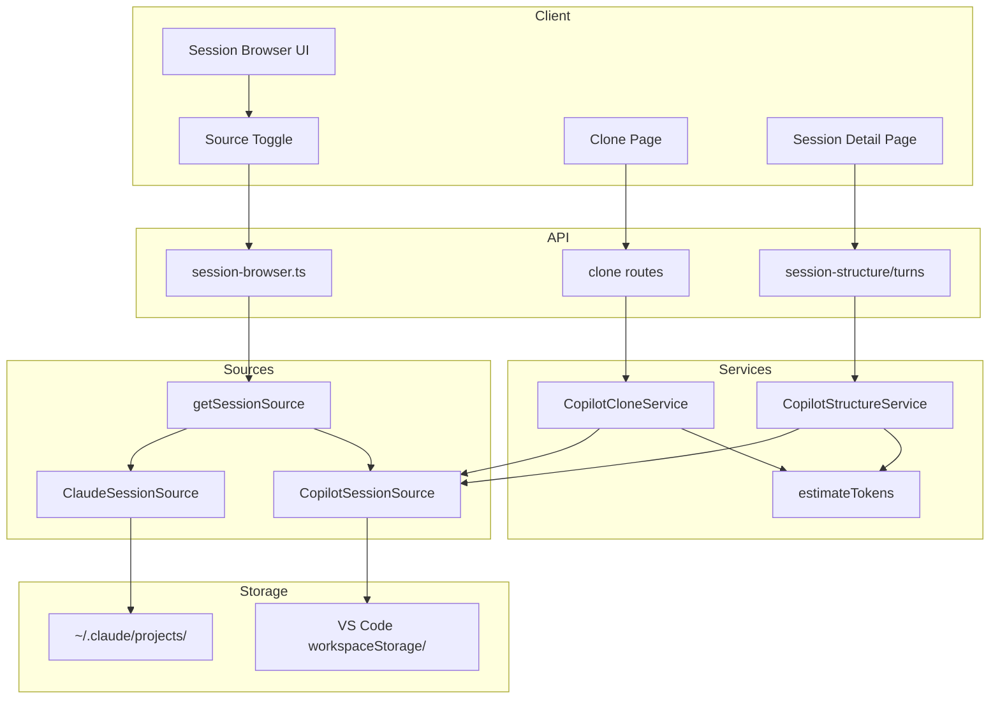
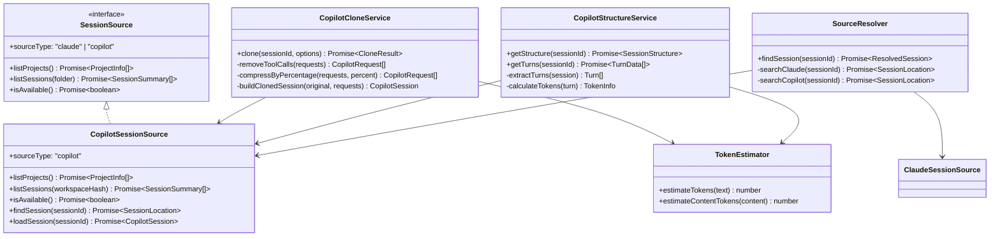
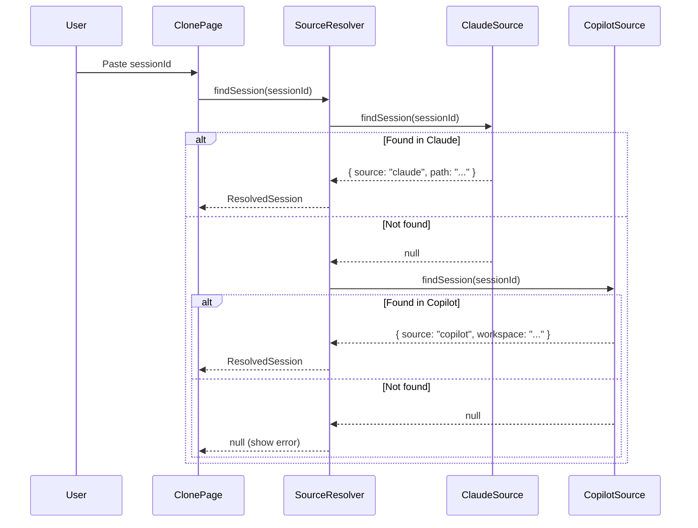
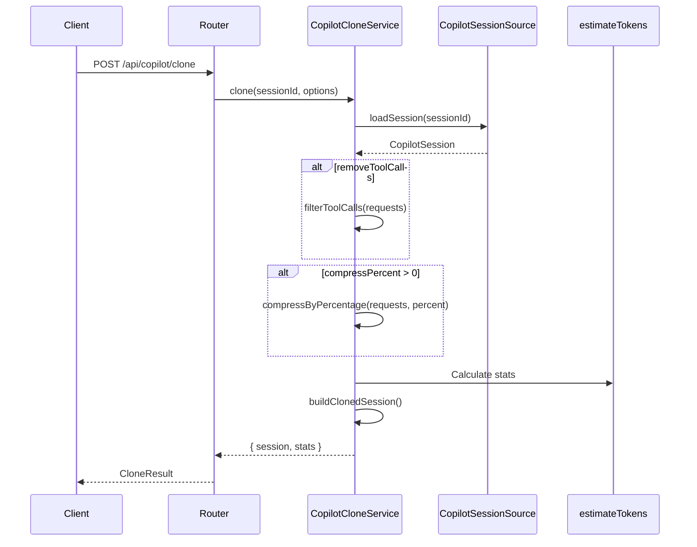
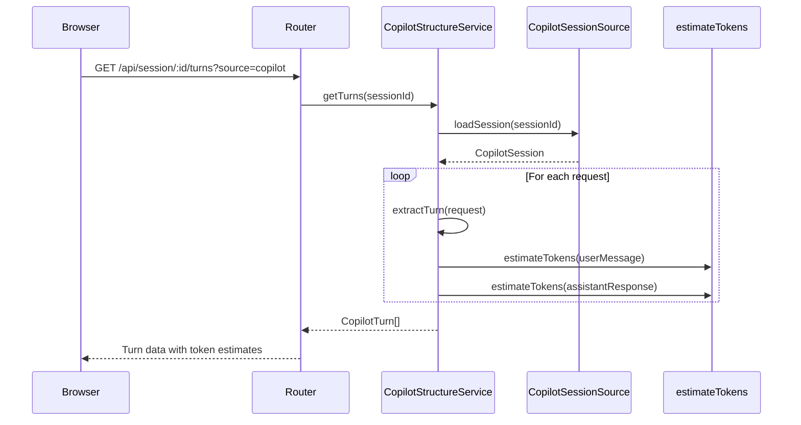

# 009 - GitHub Copilot Session Support: Technical Design

## 1. Feature Summary

### Overview

Full GitHub Copilot Chat session support including discovery, browsing, cloning, and visualization. Implements `CopilotSessionSource` for session discovery, `CopilotCloneService` for native-format cloning, and extends visualization with unified token estimation (`words * 0.75`) applied consistently across both sources.

### Functional Description

1. User opens Session Browser and sees a source toggle (Claude / Copilot)
2. User selects "Copilot" source, project dropdown reloads with Copilot workspaces
3. User selects a workspace, session list shows Copilot sessions with metadata
4. User can Clone a session (output stays in Copilot format)
5. User can Visualize a session with estimated token counts
6. Pasting a sessionId in Clone/Visualize auto-detects the source

## 2. Tech Overview

### Data Flow Diagram



### Process Steps

1. **Source Selection**: User toggles source type in UI
2. **Project Loading**: API returns projects from selected source
3. **Session Loading**: API returns sessions with metadata
4. **Clone Flow**: Session cloned in native format with compression
5. **Visualization Flow**: Session structure/turns returned with estimated tokens
6. **Auto-Detection**: Pasted sessionId searched in Claude first, then Copilot

## 3. Module Architecture

### Class Diagram



### Module Descriptions

| Module | Responsibility |
|--------|----------------|
| `src/sources/copilot-source.ts` | Session discovery and loading |
| `src/services/copilot-clone.ts` | Clone Copilot sessions in native format |
| `src/services/copilot-structure.ts` | Session structure for visualization |
| `src/lib/token-estimator.ts` | Unified token estimation |
| `src/lib/source-resolver.ts` | Auto-detect source from sessionId |
| `src/routes/session-browser.ts` | Browser and Copilot API routes |

## 4. Unified Token Estimation

### Design Decision

All token counting uses a single function everywhere:

```typescript
// src/lib/token-estimator.ts
export function estimateTokens(text: string): number {
  const words = text.trim().split(/\s+/).filter(Boolean).length;
  return Math.ceil(words * 0.75);
}
```

### Rationale

- **Consistency**: Same numbers everywhere, no reconciliation issues
- **Simplicity**: No libraries, no server-side counting
- **Speed**: Pure function, instant calculation
- **Accuracy**: Close enough for context management decisions (~75% of word count)

### Usage Locations

| Location | Before | After |
|----------|--------|-------|
| Visualization token bars | `message.usage.input_tokens` | `estimateTokens(content)` |
| Clone compression stats | Mixed sources | `estimateTokens(content)` |
| Session summary display | Varied | `estimateTokens(content)` |
| Turn token calculation | Server-side | `estimateTokens(content)` |

### Content Token Estimation

For structured content (arrays of blocks):

```typescript
export function estimateContentTokens(content: string | ContentBlock[]): number {
  if (typeof content === 'string') {
    return estimateTokens(content);
  }
  return content.reduce((sum, block) => {
    if (block.type === 'text') return sum + estimateTokens(block.text);
    if (block.type === 'tool_use') return sum + estimateTokens(JSON.stringify(block.input));
    if (block.type === 'tool_result') return sum + estimateTokens(block.content);
    return sum;
  }, 0);
}
```

## 5. Session ID Resolution

### Auto-Detection Flow



### SourceResolver Implementation

```typescript
// src/lib/source-resolver.ts
export interface ResolvedSession {
  sessionId: string;
  source: "claude" | "copilot";
  location: string; // path for Claude, workspace hash for Copilot
}

export async function resolveSession(sessionId: string): Promise<ResolvedSession | null> {
  // Try Claude first (more common)
  const claudeSource = getSessionSource("claude");
  const claudeLocation = await claudeSource.findSession(sessionId);
  if (claudeLocation) {
    return { sessionId, source: "claude", location: claudeLocation };
  }

  // Try Copilot
  const copilotSource = getSessionSource("copilot");
  const copilotLocation = await copilotSource.findSession(sessionId);
  if (copilotLocation) {
    return { sessionId, source: "copilot", location: copilotLocation };
  }

  return null;
}
```

## 6. Copilot Clone Service

### Clone Flow



### CopilotCloneService Implementation

```typescript
// src/services/copilot-clone.ts
export interface CopilotCloneOptions {
  removeToolCalls?: boolean;
  compressPercent?: number; // 0-100
}

export interface CopilotCloneResult {
  session: CopilotSession;
  stats: {
    originalTurns: number;
    clonedTurns: number;
    originalTokens: number;
    clonedTokens: number;
    compressionRatio: number;
  };
}

export class CopilotCloneService {
  async clone(sessionId: string, options: CopilotCloneOptions): Promise<CopilotCloneResult> {
    const source = getSessionSource("copilot") as CopilotSessionSource;
    const session = await source.loadSession(sessionId);

    let requests = [...session.requests];

    // Remove tool calls if requested
    if (options.removeToolCalls) {
      requests = this.removeToolCalls(requests);
    }

    // Compress by percentage if requested
    if (options.compressPercent && options.compressPercent > 0) {
      requests = this.compressByPercentage(requests, options.compressPercent);
    }

    const clonedSession = this.buildClonedSession(session, requests);
    const stats = this.calculateStats(session, clonedSession);

    return { session: clonedSession, stats };
  }

  private removeToolCalls(requests: CopilotRequest[]): CopilotRequest[] {
    return requests.map(req => ({
      ...req,
      response: req.response.filter(item =>
        item.kind !== 'toolInvocationSerialized' &&
        item.kind !== 'prepareToolInvocation'
      )
    }));
  }

  private compressByPercentage(requests: CopilotRequest[], percent: number): CopilotRequest[] {
    const removeCount = Math.floor(requests.length * (percent / 100));
    // Remove from oldest (beginning), keep most recent
    return requests.slice(removeCount);
  }

  private buildClonedSession(original: CopilotSession, requests: CopilotRequest[]): CopilotSession {
    return {
      ...original,
      requests,
      lastMessageDate: Date.now(),
      customTitle: original.customTitle ? `${original.customTitle} (cloned)` : 'Cloned session'
    };
  }
}
```

## 7. Copilot Visualization

### Structure Service

```typescript
// src/services/copilot-structure.ts
export interface CopilotTurn {
  turnIndex: number;
  userMessage: string;
  assistantResponse: string;
  toolCalls: ToolCallInfo[];
  tokens: {
    user: number;
    assistant: number;
    total: number;
  };
  timestamp: number;
}

export class CopilotStructureService {
  async getTurns(sessionId: string): Promise<CopilotTurn[]> {
    const source = getSessionSource("copilot") as CopilotSessionSource;
    const session = await source.loadSession(sessionId);

    return session.requests
      .filter(req => !req.isCanceled)
      .map((req, index) => this.extractTurn(req, index));
  }

  private extractTurn(request: CopilotRequest, index: number): CopilotTurn {
    const userMessage = request.message.text;
    const assistantResponse = this.extractAssistantText(request.response);
    const toolCalls = this.extractToolCalls(request.response);

    return {
      turnIndex: index,
      userMessage,
      assistantResponse,
      toolCalls,
      tokens: {
        user: estimateTokens(userMessage),
        assistant: estimateTokens(assistantResponse),
        total: estimateTokens(userMessage) + estimateTokens(assistantResponse)
      },
      timestamp: request.timestamp
    };
  }

  private extractAssistantText(response: ResponseItem[]): string {
    return response
      .filter(item => typeof item === 'object' && 'value' in item && typeof item.value === 'string')
      .map(item => item.value)
      .join('\n');
  }

  private extractToolCalls(response: ResponseItem[]): ToolCallInfo[] {
    return response
      .filter(item => item.kind === 'toolInvocationSerialized')
      .map(item => ({
        toolId: item.toolId,
        toolCallId: item.toolCallId,
        invocationMessage: item.invocationMessage
      }));
  }
}
```

### Visualization Data Flow



## 8. API Routes

### New Copilot Routes

| Method | Path | Handler | Description |
|--------|------|---------|-------------|
| GET | `/api/copilot/projects` | listCopilotProjects | List workspaces |
| GET | `/api/copilot/projects/:hash/sessions` | listCopilotSessions | List sessions |
| POST | `/api/copilot/clone` | cloneCopilotSession | Clone session |
| GET | `/api/copilot/session/:id/structure` | getCopilotStructure | Session structure |
| GET | `/api/copilot/session/:id/turns` | getCopilotTurns | Session turns |

### Updated Routes

| Method | Path | Change |
|--------|------|--------|
| POST | `/api/resolve-session` | NEW: Auto-detect source |
| GET | `/api/session/:id/turns` | Add `source` query param |
| GET | `/api/session/:id/structure` | Add `source` query param |

## 9. Frontend Changes

### Session Browser Updates

```javascript
// public/js/pages/session-browser.js

let currentSource = "claude";

function initSourceToggle() {
  document.getElementById("source-toggle").addEventListener("click", async (e) => {
    const btn = e.target.closest(".source-btn");
    if (!btn || btn.dataset.source === currentSource) return;

    currentSource = btn.dataset.source;
    updateSourceToggleUI();
    await loadProjects();
  });
}

async function loadProjects() {
  const endpoint = currentSource === "copilot"
    ? "/api/copilot/projects"
    : "/api/projects";
  // ...
}
```

### Clone Page Updates

```javascript
// public/js/pages/clone.js

async function resolveSessionId(sessionId) {
  const response = await fetch(`/api/resolve-session?sessionId=${sessionId}`);
  const { source, location } = await response.json();

  // Update UI to show detected source
  showSourceIndicator(source);

  // Use appropriate clone endpoint
  return { source, location };
}
```

### Session Detail Updates

```javascript
// public/js/pages/session-detail.js

async function loadSession(sessionId, source) {
  const turnsEndpoint = source === "copilot"
    ? `/api/copilot/session/${sessionId}/turns`
    : `/api/session/${sessionId}/turns`;

  const turns = await fetch(turnsEndpoint).then(r => r.json());
  renderTurns(turns);
}
```

## 10. Testing Strategy

### Test Categories

| Category | Location | Focus |
|----------|----------|-------|
| Token Estimator | `test/lib/token-estimator.test.ts` | Word counting edge cases |
| Source Resolver | `test/lib/source-resolver.test.ts` | Auto-detection logic |
| Copilot Clone | `test/services/copilot-clone.test.ts` | Clone operations |
| Copilot Structure | `test/services/copilot-structure.test.ts` | Turn extraction |
| Integration | `test/copilot-integration.test.ts` | End-to-end flows |

### Token Estimator Tests

```typescript
describe("estimateTokens", () => {
  it("returns 0 for empty string", () => {
    expect(estimateTokens("")).toBe(0);
  });

  it("calculates words * 0.75 rounded up", () => {
    expect(estimateTokens("one two three four")).toBe(3); // 4 * 0.75 = 3
  });

  it("handles multiple spaces", () => {
    expect(estimateTokens("one   two   three")).toBe(3); // Still 3 words
  });

  it("handles 100 words", () => {
    const text = Array(100).fill("word").join(" ");
    expect(estimateTokens(text)).toBe(75);
  });
});
```

## 11. Development Phases

### Phase 1: Copilot Source API + TDD Red
- Types and stubs
- Test fixtures
- Failing tests

### Phase 2: Copilot Source Implementation + TDD Green
- Full `CopilotSessionSource` implementation
- Tests pass

### Phase 3: Session Browser Multi-Source UI
- Source toggle
- Copilot routes
- Frontend updates

### Phase 4: Unified Token Estimation
- `estimateTokens()` utility
- Refactor Claude token usage
- Apply to both sources

### Phase 5: Copilot Clone Service
- `CopilotCloneService`
- Clone routes
- Clone page updates

### Phase 6: Copilot Visualization
- `CopilotStructureService`
- Structure/turns routes
- Detail page updates

### Phase 7: Integration Testing + Polish
- End-to-end tests
- Source resolver
- Error handling
- UI polish

## 12. File Inventory

### New Files

| File | Purpose |
|------|---------|
| `src/sources/copilot-types.ts` | Copilot type definitions |
| `src/sources/copilot-source.ts` | Session source implementation |
| `src/services/copilot-clone.ts` | Clone service |
| `src/services/copilot-structure.ts` | Structure service |
| `src/lib/token-estimator.ts` | Unified token estimation |
| `src/lib/source-resolver.ts` | Session ID auto-detection |
| `test/fixtures/copilot-sessions/` | Test fixtures |

### Modified Files

| File | Change |
|------|--------|
| `src/sources/index.ts` | Add Copilot to factory |
| `src/routes/session-browser.ts` | Add Copilot routes |
| `src/services/session-structure.ts` | Use token estimator |
| `src/services/session-turns.ts` | Use token estimator |
| `public/js/pages/session-browser.js` | Source toggle |
| `public/js/pages/clone.js` | Auto-detection |
| `public/js/pages/session-detail.js` | Multi-source support |
| `views/pages/session-browser.ejs` | Toggle UI |
